## The Human Eye

Our eyes are nature's most sophisticated optical devices, allowing us to perceive the vibrant colours and shapes of the world. Think of the eye as a living camera that constantly adjusts itself -- whether you are reading a book in your lap or watching a kite soar in the sky over Marina Beach.

### Parts of the Eye and Their Roles

- **Cornea** -- the transparent, dome-shaped front cover that bends incoming light sharply, doing most of the focusing work
- **Iris** -- the coloured ring (brown, black, or sometimes green) that sits behind the cornea and acts like a curtain, widening or narrowing to control how much light gets through
- **Pupil** -- the dark opening at the centre of the iris; it opens wide in a dimly-lit room and shrinks in bright sunshine
- **Eye lens** -- a soft, transparent, double-convex lens held in place by **ciliary muscles**. It fine-tunes the focus so that a sharp image lands on the retina
- **Retina** -- the light-sensitive inner surface at the back of the eye, packed with two types of specialised cells: **rod cells** (responsible for vision in low light and side vision) and **cone cells** (responsible for detecting colour in bright light)
- **Optic nerve** -- a bundle of nerve fibres that transmits electrical signals from the retina to the brain for interpretation

The image that forms on the retina is **real and inverted**, yet our brain flips it so we perceive everything right-side up.

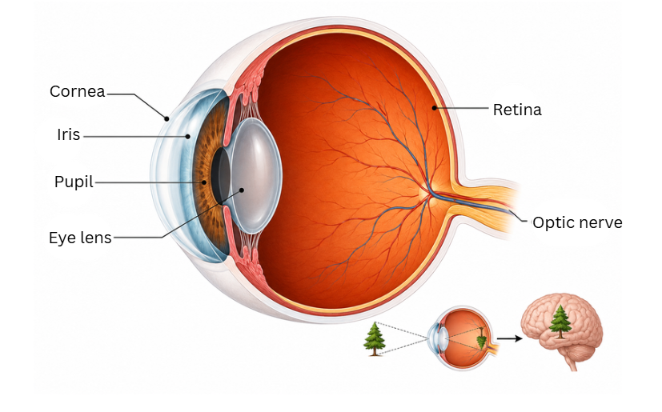

> **Key idea:** The eye lens focuses incoming light onto the retina, producing a real, inverted image. The iris regulates the quantity of light entering through the pupil.

---

## Power of Accommodation

Imagine reading the price tag on a box of sweets at the shop counter, then looking up to spot your friend waving from across the road. Your eyes shift focus seamlessly -- this ability of the eye lens to alter its focal length is called the **power of accommodation**.

- When you gaze at **faraway objects** (like a hilltop temple), the ciliary muscles loosen up, the lens stretches thin and flat, and its focal length increases
- When you look at **nearby objects** (like text on your phone), the ciliary muscles tighten, the lens becomes thicker and more curved, and its focal length decreases

The closest point at which the eye can see an object distinctly is called the **near point** (or least distance of distinct vision). For a healthy young person, this is roughly **25 cm**. The farthest point it can focus on is called the **far point**, which for a normal eye is **infinity**.

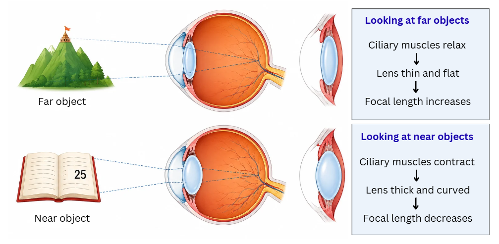

> **Key idea:** Ciliary muscles alter the curvature and focal length of the eye lens so that objects at varying distances can be brought into focus. This adjustment is the power of accommodation.

---

## Defects of Vision and Their Correction

Sometimes the eye cannot focus images properly on the retina. Three common defects and their remedies are described below.

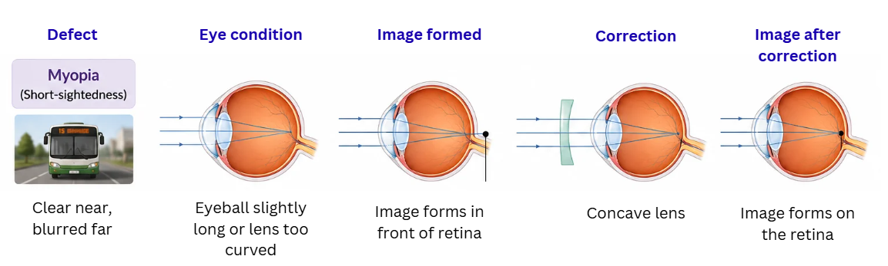

### Myopia (Short-sightedness)

A person with myopia can read a newspaper held close but cannot see the number on an approaching bus clearly. The image of a distant object falls **in front of the retina** rather than on it.

**Why it happens:** The eyeball may be slightly elongated, or the eye lens may be too curved, giving it an excessively short focal length.
**How to fix it:** A **concave lens** (diverging lens) of suitable power is placed before the eye. It spreads the incoming rays slightly outward so that after refraction by the eye lens, the image shifts back onto the retina.

### Hypermetropia (Long-sightedness)

A person with hypermetropia can enjoy a distant landscape but struggles to thread a needle. The image of a nearby object forms **behind the retina**.

**Why it happens:** The eyeball may be shorter than normal, or the lens may be too flat, producing a focal length that is too long.
**How to fix it:** A **convex lens** (converging lens) of suitable power converges the light before it enters the eye, allowing the image to form right on the retina.

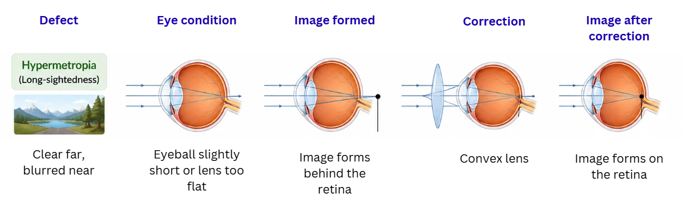

### Presbyopia

As people grow older, their ciliary muscles gradually lose strength and the lens becomes rigid. The power of accommodation drops, and the near point recedes farther from the eye -- reading small print becomes difficult.

**How to fix it:** **Bifocal lenses** are used. The upper portion contains a concave lens for viewing distant objects, and the lower portion contains a convex lens for reading.

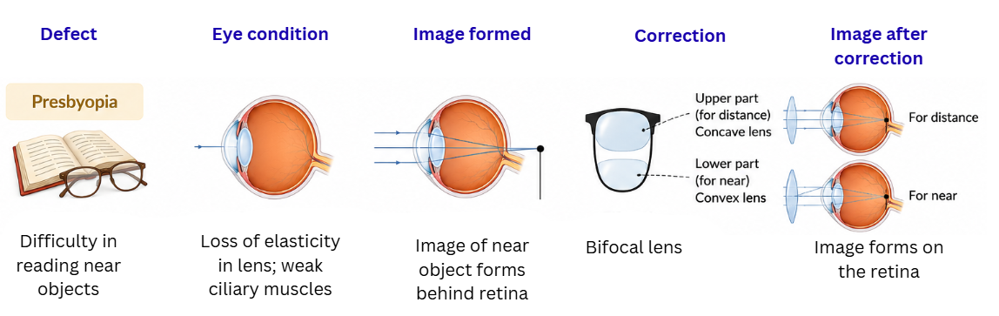

> **Key idea:** Myopia is corrected with concave lenses, hypermetropia with convex lenses, and presbyopia with bifocal lenses.

---

## Refraction of Light Through a Prism

When a narrow beam of white light enters a triangular glass **prism**, it bends twice -- once at the entry face and once at the exit face -- and emerges at a different angle. The angle between the original direction of the beam and the final direction of the emerging beam is called the **angle of deviation**.

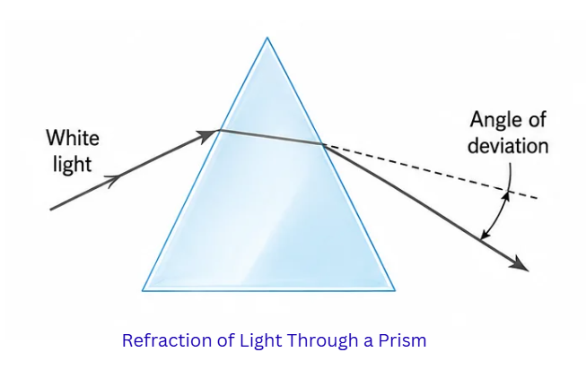

### Dispersion of White Light

A prism does something spectacular: it fans white light out into a beautiful band of seven colours known as the **spectrum**. The colours, from the most bent to the least bent, are **Violet, Indigo, Blue, Green, Yellow, Orange, and Red** -- often remembered as **VIBGYOR**.

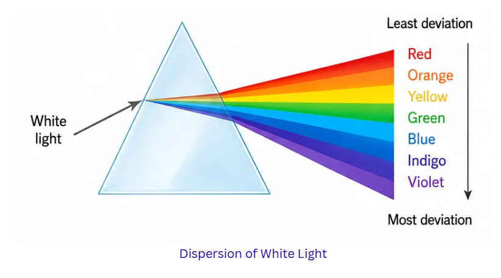

This separation is called **dispersion**. It occurs because each colour travels at a slightly different speed inside the glass. **Violet** light slows down the most and bends the most, while **Red** light slows down the least and bends the least.

**Newton's two-prism experiment:** Isaac Newton placed a second, inverted prism in the path of the spectrum produced by the first prism. The seven colours recombined to give white light, proving that the prism merely separates what is already present -- white light is a mixture of seven colours.

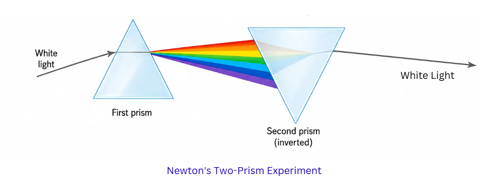

> **Key idea:** A prism disperses white light into its seven constituent colours (VIBGYOR). Each colour refracts by a different amount because it travels at a different speed in glass.

---

## Atmospheric Refraction

Earth's atmosphere is not uniform -- the air near the ground is dense and warm, while the air higher up is thinner and cooler. When light from a distant object passes through these layers, it bends gradually, creating some fascinating visual effects.

### Twinkling of Stars

On a clear night, stars seem to flicker or shimmer. This happens because starlight travels through many atmospheric layers whose temperature and density keep changing. The constantly shifting refraction causes the star's apparent brightness and position to fluctuate rapidly, producing the twinkle.

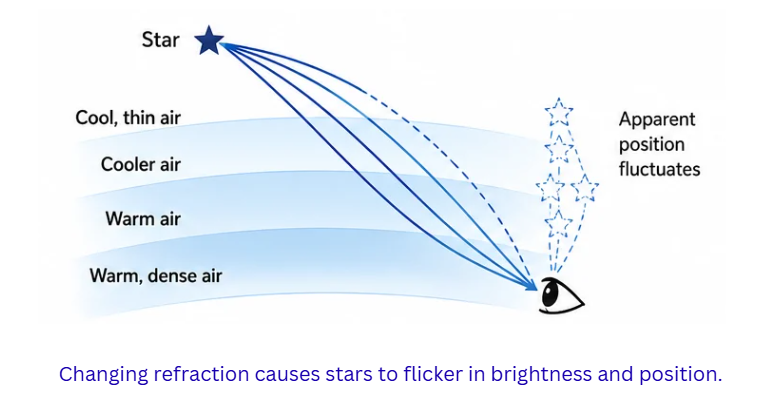

### Why Planets Appear Steady

Planets are vastly closer to us compared to stars and therefore appear as tiny discs (extended sources) rather than pinpoints. The fluctuations caused by different parts of a planet's disc tend to cancel each other out, so planets shine with a much steadier light.

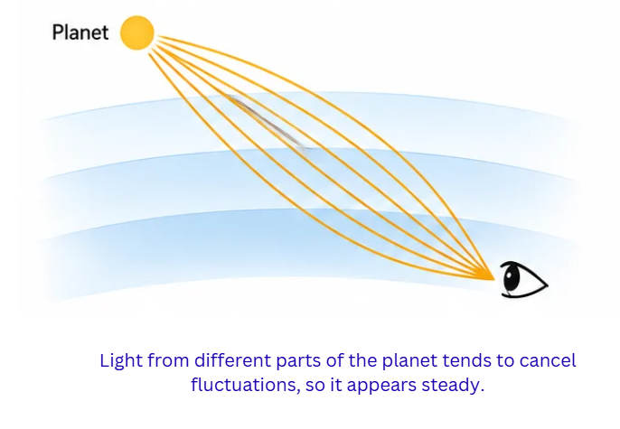

### Early Sunrise and Late Sunset

Atmospheric refraction bends sunlight over the curve of the Earth, so we can see the Sun even when it is geometrically just below the horizon. This adds about **2 minutes** of extra visibility at both sunrise and sunset.

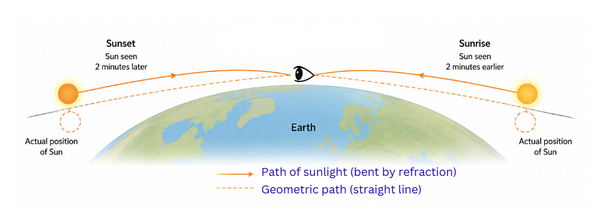

> **Key idea:** Atmospheric refraction is responsible for the twinkling of stars, the steady glow of planets, and the Sun appearing a couple of minutes before actual sunrise and after actual sunset.

---

## Scattering of Light

When sunlight encounters tiny particles or molecules in the atmosphere, different colours scatter in different amounts. This phenomenon is called **scattering of light**.

### Tyndall Effect

If you shine a torch through a foggy evening or into a glass of milk mixed with water, you can see the beam's path clearly. This visibility of a light beam in a colloidal medium is the **Tyndall effect** -- fine suspended particles scatter the light sideways into your eyes.

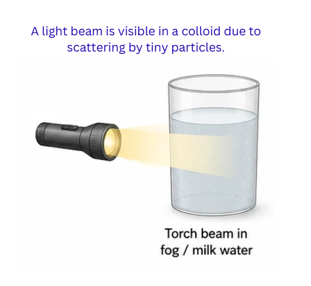

### Why the Sky Looks Blue

The atmosphere is full of tiny nitrogen and oxygen molecules. These molecules are most effective at scattering short-wavelength light (blue and violet). This preferential scattering, called **Rayleigh scattering**, sends blue light in every direction across the sky. Although violet scatters even more than blue, our eyes are more sensitive to blue, so the sky appears blue.

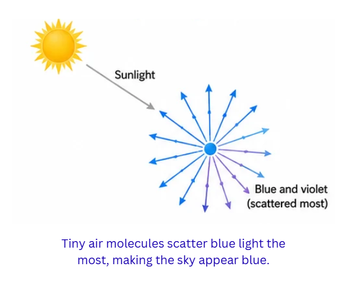

### Why the Sky Is Black in Outer Space

Astronauts looking out of the International Space Station see a pitch-black sky even during daytime. There is no atmosphere in space, so there are no molecules to scatter sunlight -- without scattering, the sky has no colour.

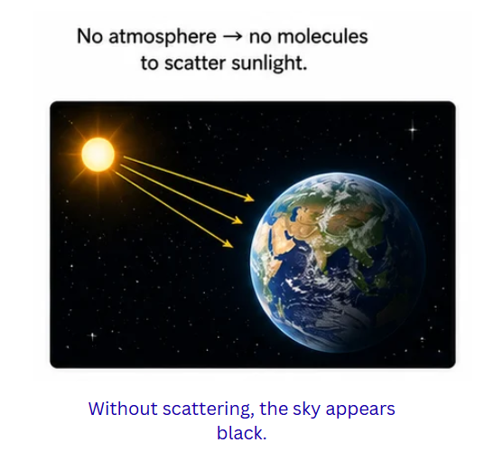

### Why the Sun Looks Reddish-Orange at Dawn and Dusk

At sunrise and sunset, sunlight must travel through a much thicker slice of the atmosphere to reach your eyes. Along this extended path, most of the blue and violet light gets scattered away, and primarily the longer-wavelength red and orange light survives the journey. This is why the rising or setting Sun often paints the sky in warm shades of red and orange -- a sight beautifully visible from the ghats of Varanasi or the beaches of Goa.

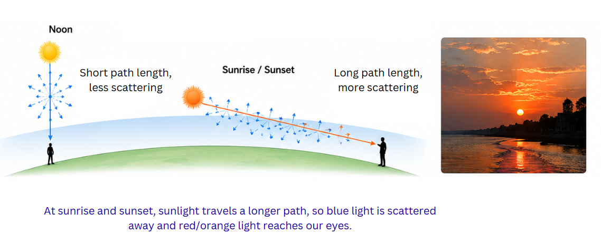

> **Key idea:** Rayleigh scattering of shorter wavelengths (blue) by atmospheric molecules makes the daytime sky blue. At sunrise and sunset, the longer atmospheric path removes most blue light, leaving the Sun looking reddish-orange.

---

## Apply What You Have Learned

### Where you see this in real life

**Aravind Eye Hospital — high-volume cataract surgery.** Started in Madurai in 1976 by Dr Govindappa Venkataswamy, Aravind has performed millions of cataract surgeries — many of them free for patients who cannot afford to pay. The same lens-clouding you read about in this chapter is the leading cause of blindness in India. The model has become a global case study in how science plus careful workflow design can restore sight to lakhs of people every year.

**Near-sightedness in school kids — what's going wrong.** Pediatric ophthalmologists in cities like Bengaluru, Mumbai, and Hyderabad are reporting that myopia is now common in children as young as Class 4. The cause they keep pointing to — long screen hours, less outdoor play, near-work in poor lighting. The chapter's explanation is sitting right on every school noticeboard. A concave lens fixes the image position, but reducing screen time and adding outdoor light is the long-term prevention.

**Mumbai sunsets and Diwali pollution.** On a normal evening from Marine Drive, the setting Sun looks orange because blue light has been scattered out by the long atmospheric path. During Diwali week, extra particles from firecrackers and stubble burning in north India intensify the red — sunsets become unusually deep and dramatic. The same chapter on Rayleigh scattering explains both the everyday sunset and the festival-time intensification.

### Try it at home — the family vision survey

*⏱ 30 minutes total over two evenings · 🧹 zero mess · 👨‍👩‍👧 no adult help needed, but you'll be testing 5 family members*

**What you'll need:**

- A printout of a Snellen eye chart (search online — many are free). Print it at the standard A4 size.
- Cellotape and a marked spot on the floor exactly 6 metres from where you will hang the chart (or 3 metres if you only have a smaller printout — read the print instructions).
- A torch (optional, for testing pupil response in dim light).
- A notebook and pen.

**Steps:**

1. Tape the Snellen chart to a wall at eye level. Measure out the correct distance and mark a standing spot on the floor.
2. One by one, ask **5 family members** to stand at the spot and read the chart aloud from top to bottom — left eye covered first, then right eye. Note the smallest line each eye can read clearly.
3. Note each person's age and whether they currently wear glasses.
4. For one or two adults, also test the **near point** — how close can they bring small print (a newspaper or this chapter) before it goes blurry? A healthy young eye manages about 25 cm. Older relatives often cannot focus closer than 40–50 cm.
5. Plot a rough graph or table — age on one axis, near point distance or smallest readable line on the other.

**What to look for:**

- Is there a pattern with age? Most likely yes — presbyopia after about 40.
- Are kids in your family already needing glasses? Compare with what NCERT calls myopia.
- Do your relatives with glasses know whether their lenses are concave or convex? (Their prescription will say.) Match that to the defect they have.

**Show what you found:** Show your notebook to your daadi (or dadu, mummy, or older cousin). Explain one thing about their eyes that you understood for the first time — maybe why they hold the newspaper at arm's length, or why your younger cousin's prescription has minus power. Watch them connect their daily experience to a chapter in your textbook.

**A question to keep asking all year:** *When something around me — the way the sky looks, the way someone reads, the way light bends through water — surprises me, which idea from this chapter could explain it?*
