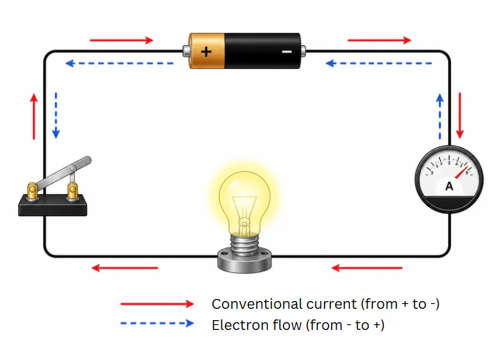
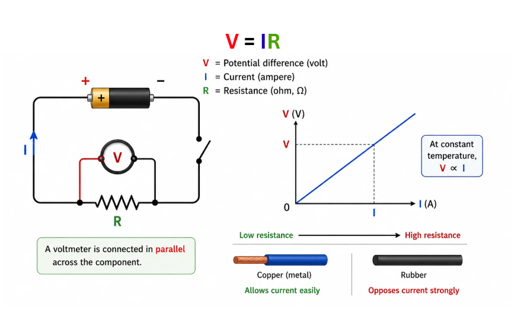
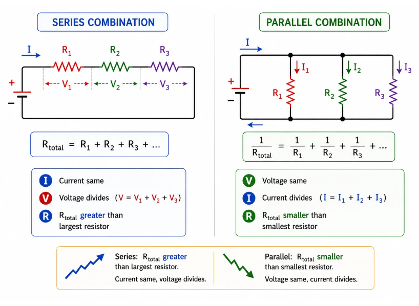

## Electric Current and Circuit

Picture a crowded Mumbai local train platform at rush hour -- people stream through the gates in one direction. In a similar way, **electric current** is the steady flow of electric charge (electrons) through a conductor. By convention, we say that current flows from the positive terminal to the negative terminal of a battery, even though electrons physically move the other way.

**Electric current (I) = Charge (Q) / Time (t)**, measured in **amperes (A)**. 1 A means 1 coulomb of charge passes through a point every second.

An **electric circuit** is a continuous, unbroken loop that provides a pathway for current. It typically includes a power source (such as a cell or battery), conducting wires, a switch to open or close the circuit, and one or more electrical components.

An **ammeter** is the instrument that measures current. It must be connected in **series** so that all the charge flowing through the circuit passes through it.

> **Key idea:** Electric current is the rate at which charge flows through a conductor. In a closed circuit, current travels from the positive to the negative terminal of the battery.

---

## Electric Potential and Potential Difference

Think of water in an overhead tank: it flows down through pipes because there is a height difference. Similarly, charges flow through a circuit because of a difference in electric potential between two points. This difference is called the **potential difference**.

**V = W / Q**, measured in **volts (V)**. 1 volt means 1 joule of work is done in moving 1 coulomb of charge between the two points.

A **voltmeter** measures potential difference. It is connected in **parallel** across the component whose voltage you want to measure.

> **Key idea:** Potential difference is the driving force that pushes current through a circuit. A voltmeter is always connected in parallel.

---

## Ohm's Law

**Ohm's Law** tells us that, at a constant temperature, the current through a metallic conductor is directly proportional to the potential difference applied across its ends.

**V = IR**

Here, R is the **resistance** of the conductor, measured in **ohms** (symbol **Omega**). Resistance is the opposition that a material offers to the flow of current -- metals like copper have low resistance, while materials like rubber offer extremely high resistance.

---

## What Determines Resistance?

The resistance of a conductor depends on four factors:

1. **Length (l):** Longer the wire, greater the resistance. Think of it as a longer corridor being harder to walk through.
2. **Cross-sectional area (A):** Thicker the wire, lower the resistance. A wider pipe lets more water through easily.
3. **Nature of the material:** Different substances resist current differently.
4. **Temperature:** For most metals, resistance rises as temperature increases.

These factors are captured in the formula:

**R = rho x l / A**

Here, **rho** (resistivity) is a property of the material itself, measured in ohm-metre. It does not change with the dimensions of the conductor but does depend on temperature.

Copper and aluminium have very low resistivity -- they are excellent conductors. Alloys like nichrome and manganin have high resistivity -- they are used in heaters and rheostats. Rubber and glass have enormous resistivity -- they serve as insulators.

> **Key idea:** Resistance is governed by the conductor's length, cross-sectional area, and the resistivity of its material. R = rho x l / A.

---

## Combining Resistors

### Series Combination

When resistors are connected end-to-end, the same current passes through each one:

**R_total = R1 + R2 + R3 + ...**

- The current is **identical** through every resistor
- The total voltage **splits** among the resistors: V = V1 + V2 + V3
- The combined resistance is always **larger** than the biggest individual resistor

### Parallel Combination

When resistors are connected between the same pair of points, each one receives the full supply voltage:

**1/R_total = 1/R1 + 1/R2 + 1/R3 + ...**

- The voltage is the **same** across every resistor
- The total current **divides** among the branches: I = I1 + I2 + I3
- The combined resistance is always **smaller** than the smallest individual resistor

> **Key idea:** In series, resistances add up and current stays constant. In parallel, the reciprocals of resistances add up and voltage stays constant.

---

## Heating Effect of Electric Current

When current pushes its way through a resistance, electrical energy transforms into **heat energy**. This is the **heating effect** of electric current, also known as Joule heating.

**Heat produced: H = I squared x R x t** (Joule's law of heating)

Equivalently, H = V x I x t = V squared x t / R

### Everyday Applications
- **Cooking appliances:** Electric stoves, toasters, and kettles all use high-resistance coils to generate heat
- **Lighting:** In an incandescent bulb, the tungsten filament heats up until it glows white-hot
- **Safety fuses:** A thin wire of low melting point that melts and breaks the circuit when the current exceeds a safe limit

### Why Alloys for Heating Elements?
Alloys such as nichrome possess **high resistivity** (to produce ample heat), **high melting points** (to avoid melting during use), and strong resistance to oxidation at elevated temperatures.

### Why Tungsten for Bulb Filaments?
Tungsten can withstand temperatures as high as 3380 degrees Celsius without melting, making it ideal for glowing white-hot inside a bulb. It also has high resistivity.

> **Key idea:** The heat generated in a conductor is proportional to the square of the current, the resistance, and the time (H = I squared x R x t). Alloys with high resistivity and high melting points are chosen for heating devices.

---

## Electric Power

**Electric power** is the rate at which electrical energy is consumed or transformed.

**P = V x I = I squared x R = V squared / R**, measured in **watts (W)**

1 watt = 1 joule per second = 1 volt multiplied by 1 ampere

The commercial unit of electrical energy is the **kilowatt-hour (kWh)**, popularly called a "unit" on electricity bills.

**1 kWh = 1000 W x 3600 s = 3.6 x 10 to the power 6 joules**

### Why Are Home Appliances Wired in Parallel?

In every Indian home, appliances are connected in **parallel** across the 220 V supply. Here is why:
- Each device receives the **full 220 V** supply voltage
- Each device can be **switched on or off independently** -- turning off the kitchen light does not affect the fan in the bedroom
- If one appliance fails, the remaining ones keep working
- Adding more appliances does not increase the resistance seen by existing ones

> **Key idea:** Electric power (P = V x I) is measured in watts. The kWh is the commercial unit of energy. Household appliances are wired in parallel so that each one gets the full voltage and works independently.
