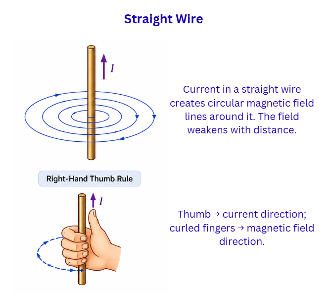
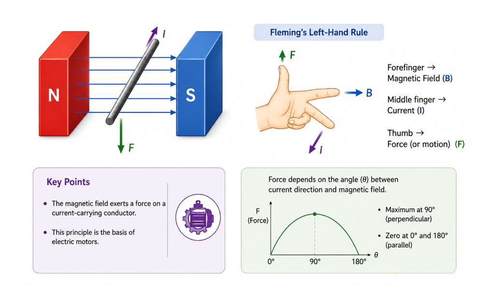
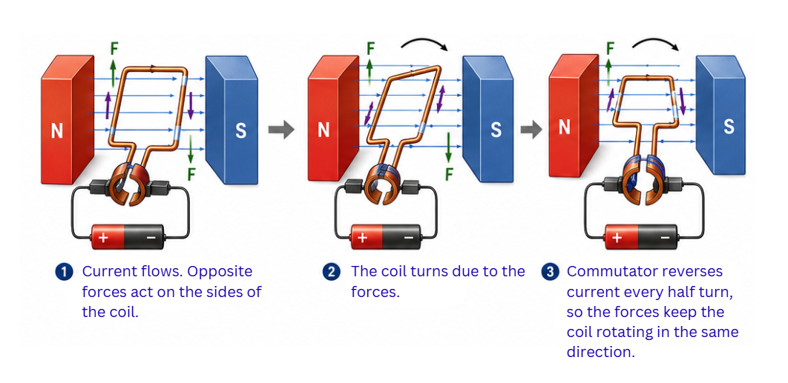
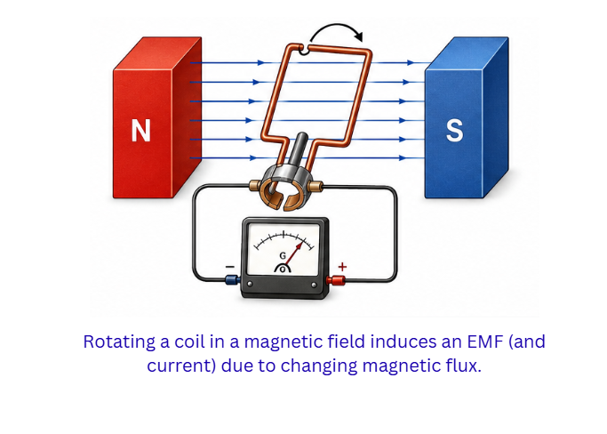

## Introduction

In 1820, a Danish scientist named Hans Christian Oersted noticed something unexpected during a lecture demonstration: a compass needle sitting near a wire deflected the moment he switched the current on. This simple observation revealed a profound truth -- **electricity and magnetism are intimately connected**. A current-carrying conductor creates a magnetic field in the space around it.

> **Key idea:** Whenever electric current flows through a conductor, a magnetic field appears around it, linking electricity and magnetism.

---

## Magnetic Field and Field Lines

A **magnetic field** is an invisible region surrounding a magnet or a current-carrying conductor where magnetic forces can act. We represent this field using imaginary curves called **magnetic field lines**.

Key properties of magnetic field lines:
- Outside the magnet, they curve from the **north pole** to the **south pole**
- Inside the magnet, they run from south pole to north pole, completing closed loops
- They form **continuous closed curves** -- they never begin or end anywhere
- Two field lines **never cross** each other (because the field can have only one direction at any point)
- Where lines are packed **closely together**, the field is **strong**; where they are spread apart, the field is weak

> **Key idea:** Magnetic field lines reveal the direction and intensity of the magnetic field. They are always closed loops and never intersect.

---

## Magnetic Field Due to a Current-Carrying Conductor

### Straight Wire

When current flows through a straight wire, the magnetic field takes the shape of **concentric circles** centred on the wire. The field weakens as you move farther from the wire.

**Right-Hand Thumb Rule:** Imagine gripping the wire with your right hand so that your thumb points in the direction of the current. Your curled fingers then show the direction in which the circular field lines wrap around the wire.

### Circular Loop (Single Coil)

A circular loop of current-carrying wire produces a field pattern that looks like a short bar magnet when viewed from a distance. At the centre of the loop, the field lines are nearly straight and parallel, creating a roughly uniform field. The field strength at the centre increases with more turns, more current, and a smaller loop radius.

### Solenoid

A **solenoid** is a long coil made of many tightly wound circular turns. When current passes through it, the solenoid behaves exactly like a **bar magnet** -- one end becomes a north pole and the other a south pole.

Inside the solenoid, the field is **uniform** -- the field lines are parallel and evenly spaced. Inserting a rod of **soft iron** into the solenoid dramatically strengthens the field, creating an **electromagnet**.

Advantages of electromagnets over permanent magnets:
- They can be switched on and off at will
- Their strength can be adjusted by changing the current
- Their polarity can be reversed by reversing the current direction

> **Key idea:** A current-carrying solenoid mimics a bar magnet. Placing a soft iron core inside produces a powerful, controllable electromagnet.

---

## Force on a Current-Carrying Conductor in a Magnetic Field

Place a current-carrying wire between the poles of a strong magnet and something dramatic happens -- the wire jumps! The magnetic field exerts a **force** on the conductor. This is the principle that drives **electric motors**.

**Fleming's Left-Hand Rule:** Stretch the thumb, forefinger, and middle finger of your left hand so that each is perpendicular to the other two:
- **Forefinger** --> direction of the magnetic **Field** (B)
- **Middle finger** --> direction of the **Current** (I)
- **Thumb** --> direction of the **Force** (or motion) on the conductor

The force reaches its maximum when the current direction is **perpendicular** to the field, and drops to zero when they are **parallel**.

> **Key idea:** A current-carrying conductor placed in a magnetic field experiences a force. Fleming's left-hand rule predicts its direction. This principle is the basis of the electric motor.

---

## Electric Motor

An **electric motor** transforms **electrical energy into rotational mechanical energy**.

**How it works:** A rectangular coil of insulated copper wire is placed between the poles of a permanent magnet. When current flows through the coil, each side experiences a force in opposite directions (Fleming's left-hand rule), creating a turning effect that spins the coil.

**Main components:**
- **Armature coil** -- the rectangular coil that rotates
- **Permanent magnets** -- provide the magnetic field
- **Split ring commutator** -- two half-rings that reverse the direction of current through the coil every half revolution, ensuring the coil keeps spinning in the same direction
- **Carbon brushes** -- pressed against the commutator to maintain electrical contact as it rotates

**Where motors are found:** Ceiling fans, washing machines, water pumps, mixer-grinders, electric rickshaws, and computer hard drives.

> **Key idea:** In an electric motor, a current-carrying coil in a magnetic field rotates due to the force on it. The split ring commutator reverses the current every half turn to maintain continuous rotation.

---

## Electromagnetic Induction

What if we flip the idea of a motor? Instead of using current to produce motion, can motion produce current? **Michael Faraday** showed that the answer is yes.

When a magnet is pushed into a coil (or pulled out), or when the coil itself moves in a magnetic field, a current appears in the coil. This current is called an **induced current**, and the phenomenon is **electromagnetic induction**.

**Requirements for induction:**
- There must be a **change** in the magnetic field linked with the coil (either by moving the magnet or the coil)
- Reversing the direction of motion reverses the direction of the induced current

**Fleming's Right-Hand Rule:** Extend the thumb, forefinger, and middle finger of your right hand at right angles to each other:
- **Forefinger** --> direction of the magnetic **Field**
- **Thumb** --> direction of **Motion** of the conductor
- **Middle finger** --> direction of the **Induced current**

> **Key idea:** A changing magnetic field induces an electric current in a conductor. Fleming's right-hand rule gives the direction of this induced current.

---

## Electric Generator

An **electric generator** does the opposite of a motor -- it converts **mechanical energy into electrical energy**.

**Principle:** When a coil is spun inside a magnetic field, the continually changing magnetic flux through the coil induces an EMF (and therefore a current) in it.

### AC Generator vs DC Generator

| Feature | AC Generator | DC Generator |
|---|---|---|
| Output | Alternating current (reverses direction periodically) | Direct current (flows in one direction) |
| Contact mechanism | **Slip rings** (complete rings) | **Split ring commutator** (ring split into two halves) |
| Waveform | Sinusoidal (smooth wave) | Pulsating but unidirectional |

In India, the mains supply is **AC at 220 V and 50 Hz**. A frequency of 50 Hz means the current reverses direction **100 times every second**. AC is preferred for long-distance power transmission because transformers can easily step the voltage up or down -- high voltage for efficient transmission, low voltage for safe domestic use.

> **Key idea:** Generators convert mechanical energy to electrical energy through electromagnetic induction. AC generators use slip rings; DC generators use a split ring commutator.

---

## Domestic Electric Circuits

In Indian homes, the electricity supply arrives through three wires:

- **Live wire (red insulation)** -- carries current at high potential (~220 V)
- **Neutral wire (black insulation)** -- completes the circuit, at roughly zero potential
- **Earth wire (green insulation)** -- a safety wire connected to a metal plate buried in the ground

### Safety Devices

- **Fuse** -- a thin wire of low melting point placed in series with the live wire. When current exceeds a safe limit, Joule heating melts the fuse, breaking the circuit
- **MCB (Miniature Circuit Breaker)** -- an automatic switch that trips when current crosses the rated value; unlike a fuse, it can be reset
- **Earthing** -- if a live wire accidentally touches the metal body of an appliance, the earth wire provides a low-resistance path to the ground, preventing electric shock to the user

A **short circuit** occurs when live and neutral wires touch each other directly, creating a path of almost zero resistance and drawing a dangerously high current. **Overloading** happens when too many appliances draw current from the same circuit simultaneously.

> **Key idea:** The domestic circuit uses three wires (live, neutral, earth) and employs fuses, MCBs, and earthing to safeguard against short circuits and overloading.
