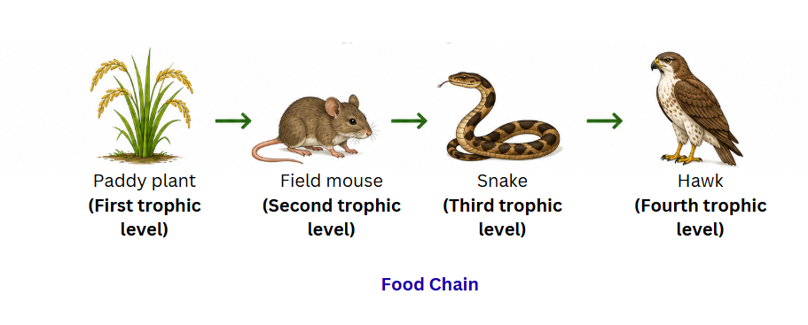
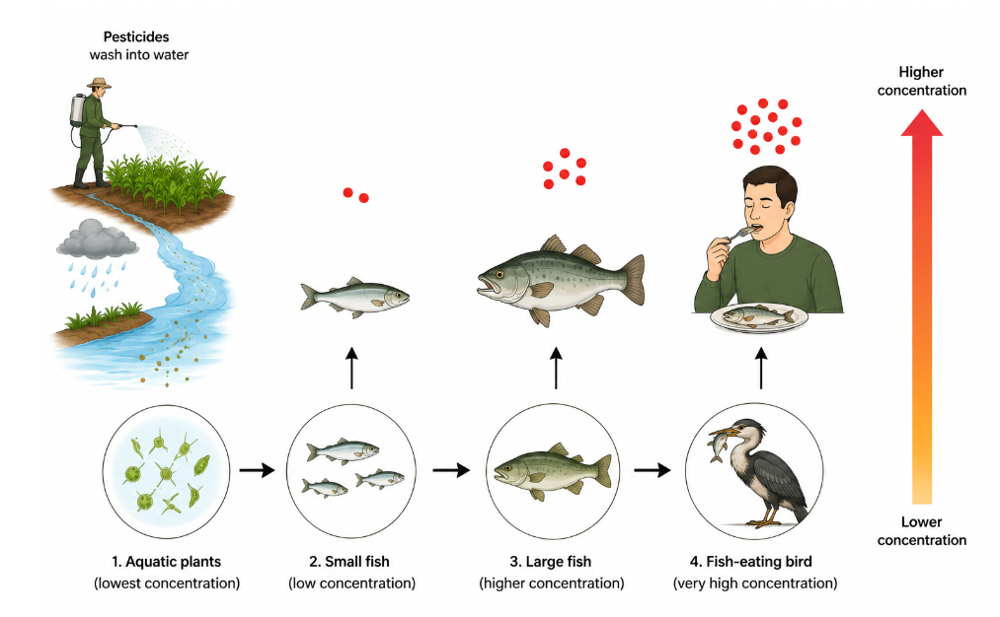
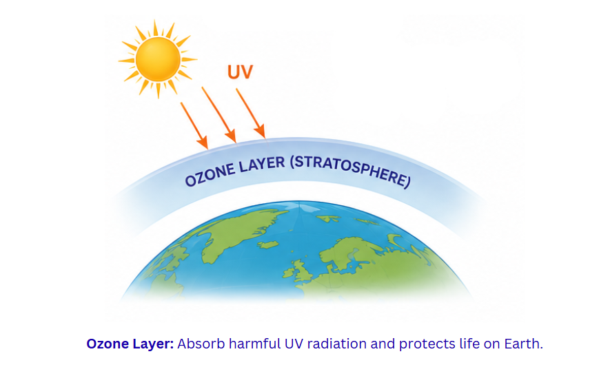

## Ecosystem and Its Components

Walk into any park in your neighbourhood -- say, Cubbon Park in Bengaluru or Lodhi Garden in Delhi -- and you will find trees, birds, insects, squirrels, and microbes in the soil, all interacting with sunlight, water, air, and minerals. This interconnected community of living and non-living things functioning together is called an **ecosystem**.

**Biotic components** are all the living inhabitants -- plants, animals, fungi, bacteria, and human beings.

**Abiotic components** are the non-living factors -- sunlight, temperature, water, wind, soil minerals, and humidity.

Ecosystems can be:
- **Natural** -- forests, ponds, rivers, oceans, deserts, grasslands
- **Human-made (artificial)** -- crop fields, gardens, fish tanks, dams

Organisms in an ecosystem are classified by how they obtain their food:
- **Producers (autotrophs)** -- green plants and some bacteria that prepare food through photosynthesis, using sunlight as the energy source
- **Consumers (heterotrophs)** -- organisms that cannot make their own food and depend on others. They include **herbivores** (plant-eaters like goats and deer), **carnivores** (meat-eaters like tigers and eagles), **omnivores** (eat both, like bears and crows), and **parasites** (live on or inside a host)
- **Decomposers** -- bacteria and fungi that feed on dead remains and waste products, breaking them down into simple inorganic substances that enrich the soil

> **Key idea:** An ecosystem comprises biotic (living) and abiotic (non-living) components. Organisms function as producers, consumers, or decomposers depending on how they get their nourishment.

---

## Food Chains and Food Webs

A **food chain** traces the path of food (and energy) from one organism to the next in a sequence.

Each position in a food chain is called a **trophic level**:
- **First trophic level** -- Producers (green plants)
- **Second trophic level** -- Primary consumers (herbivores)
- **Third trophic level** -- Secondary consumers (small carnivores)
- **Fourth trophic level** -- Tertiary consumers (top carnivores)

A simple example: Paddy plants --> Field mice --> Snakes --> Hawks

In the real world, most organisms eat and are eaten by more than one species. When many food chains interlink, they form a complex network called a **food web**.

> **Key idea:** A food chain is a linear pathway showing energy transfer from producers through successive consumers. Multiple interconnected food chains create a food web.

---

## Flow of Energy in an Ecosystem

Energy enters an ecosystem through sunlight and follows strict rules as it moves through trophic levels:

1. **Capture efficiency:** Green plants convert roughly **1 %** of the solar energy falling on their leaves into food through photosynthesis
2. **The 10 % rule:** At each trophic level, only about **10 %** of the energy received is passed on to the next level. The remaining 90 % is used in life processes (respiration, movement, reproduction) or lost as heat
3. **One-way flow:** Energy moves in a single direction -- from the Sun to producers to consumers. It never flows backwards
4. **Progressive decline:** Because energy drops sharply at each step, there is not enough left to support more than **3 or 4 trophic levels** in most food chains
5. **Number pyramid:** The base of the ecosystem (producers) typically has the most individuals, while top predators are the fewest

> **Key idea:** Only 10 % of energy transfers from one trophic level to the next. Energy flows in one direction and diminishes rapidly, which is why food chains rarely exceed 3-4 levels.

---

## Biological Magnification

**Biological magnification** (or biomagnification) is the process by which certain non-biodegradable chemicals -- especially pesticides like DDT -- accumulate in increasingly higher concentrations at each successive trophic level.

Here is how it works:
- Farmers spray pesticides on crops; rain washes these chemicals into rivers and ponds
- Tiny aquatic plants absorb small amounts of the chemical
- A small fish eats thousands of these plants and accumulates all their chemical burden
- A large fish eats dozens of small fish, concentrating the chemical further
- A fish-eating bird at the top of the chain ends up with an enormously high concentration

Since these chemicals are **non-biodegradable**, organisms cannot break them down or excrete them. **Humans**, who often sit at the top of food chains, end up with the highest concentration of such toxins in their bodies.

> **Key idea:** Non-biodegradable chemicals like pesticides accumulate at rising concentrations through the food chain. Organisms at the top -- including humans -- bear the greatest chemical burden.

---

## Ozone Layer and Its Depletion

**Ozone (O3)** is a form of oxygen made up of three oxygen atoms. Near the ground it is a harmful pollutant, but high up in the **stratosphere**, it forms a protective blanket that absorbs dangerous **ultraviolet (UV) radiation** from the Sun -- radiation that can cause skin cancer, cataracts, and damage to crops.

**How ozone forms:**
- High-energy UV rays split oxygen molecules: O2 --> O + O
- Free oxygen atoms combine with intact O2 molecules: O + O2 --> O3

**How ozone is depleted:**
- Human-made chemicals called **chlorofluorocarbons (CFCs)**, once widely used in refrigerators, air conditioners, and aerosol cans, rise into the stratosphere
- There, UV rays break CFCs apart, releasing chlorine atoms
- Each chlorine atom can destroy thousands of ozone molecules, thinning the ozone layer
- A dramatic thinning (the "ozone hole") was detected over Antarctica in the 1980s

**International action:**
- In **1987**, the **Montreal Protocol** was signed under the United Nations Environment Programme (UNEP), committing nations to phase out CFC production
- India has actively participated in this effort and received recognition for its progress
- CFC-free refrigerants are now mandatory, and the ozone layer is slowly recovering

> **Key idea:** The stratospheric ozone layer shields life from harmful UV radiation. CFCs deplete this layer. The Montreal Protocol has been a landmark international effort to protect it.

---

## Waste Management -- Biodegradable and Non-biodegradable

Every day, households, shops, and factories generate waste. Understanding what happens to that waste is essential for protecting the environment.

**Biodegradable substances** -- materials that bacteria, fungi, and other decomposers can break down into simple, harmless compounds within a reasonable time. Examples: fruit and vegetable peels, leftover food, paper, cotton cloth, garden trimmings.

**Non-biodegradable substances** -- materials that natural biological processes cannot decompose. They persist in the environment for decades or centuries. Examples: plastic bags, polythene wrappers, aluminium foil, glass bottles, synthetic fabrics, chemical pesticides.

### Why does this distinction matter?

- Decomposers work with **specific enzymes** that recognise natural organic molecules. Synthetic materials like plastic have molecular structures that no known natural enzyme can break apart
- Non-biodegradable waste **chokes drains**, **poisons soil and water**, harms animals that accidentally ingest it, and lingers for hundreds of years
- Even biodegradable waste, if dumped carelessly in large quantities, can **rot and smell**, attract disease-carrying insects, and release harmful gases like methane

### What can we do?

- **Separate** wet (biodegradable) and dry (non-biodegradable) waste at home
- **Reduce** consumption of disposable items -- carry a cloth bag to the market instead of accepting a plastic one
- **Reuse** containers, bottles, and bags whenever possible
- **Recycle** paper, metals, glass, and certain plastics through proper channels
- **Compost** kitchen waste to turn it into nutrient-rich manure for plants

> **Key idea:** Biodegradable waste is decomposed by natural biological processes; non-biodegradable waste persists indefinitely. Practising reduce, reuse, and recycle is vital for a cleaner environment.
