## Introduction

Consider everything around you that comes from living things: the cotton in your school uniform, the ghee on your paratha, the wooden furniture in your classroom, the paper in your notebook, the medicines in your first-aid box, and every cell in your own body. What do all these have in common? They are built from compounds of **carbon**. Despite making up only about **0.02%** of the earth's crust (in the form of minerals like limestone and coal) and roughly **0.03%** of the atmosphere (as carbon dioxide), carbon forms an extraordinarily vast number of compounds — estimated to number in the millions. No other element comes close to this diversity.

> **Key idea:** Carbon is the foundation of all living matter and organic chemistry. Its unique bonding abilities allow it to form millions of diverse compounds from a relatively small presence in nature.

---

## Bonding in Carbon — The Covalent Bond

Most carbon compounds are **poor conductors of electricity** and have **low melting and boiling points**. This tells us that carbon does not form ions the way sodium or chlorine do. Instead, carbon atoms **share** electrons with other atoms.

Carbon has **4 electrons** in its outermost shell (atomic number 6, electronic configuration 2,4). Gaining 4 more electrons would be extremely energy-intensive because the nucleus would have to hold 10 electrons. Losing 4 electrons would also require prohibitive energy. The elegant solution? **Sharing** — each carbon atom shares its 4 valence electrons with neighbouring atoms, achieving the stable 8-electron (octet) configuration.

### Types of Covalent Bonds

Bonds formed through **shared electron pairs** are called **covalent bonds**.

- **Single bond:** One shared pair — e.g., H—H in hydrogen gas (H₂), C—H bonds in methane (CH₄)
- **Double bond:** Two shared pairs — e.g., O=O in oxygen gas (O₂), C=C in ethene (C₂H₄)
- **Triple bond:** Three shared pairs — e.g., N≡N in nitrogen gas (N₂), C≡C in ethyne (C₂H₂)

**Characteristics of covalent compounds:**
- Low melting and boiling points (weak attractions between molecules)
- Generally do not conduct electricity (no free ions or electrons)
- Strong bonds within each molecule but feeble forces between separate molecules

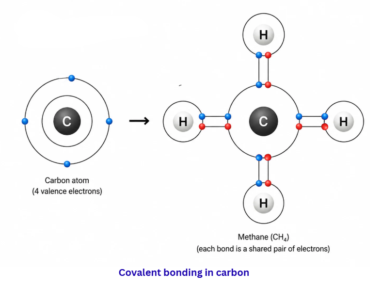

### Allotropes of Carbon

The same carbon atoms can arrange themselves in dramatically different ways, producing **allotropes**:

- **Diamond:** Every carbon atom bonds to four others in a three-dimensional lattice. This makes diamond the hardest natural substance with an extremely high melting point. It does not conduct electricity.
- **Graphite:** Each carbon atom bonds to three others in flat hexagonal sheets. These sheets slide over one another, making graphite soft and slippery. The free fourth electron in each atom allows graphite to conduct electricity.
- **Fullerenes:** Carbon atoms link into hollow cage-like structures. The most famous is **C₆₀** (buckminsterfullerene), shaped like a football with 60 carbon atoms.

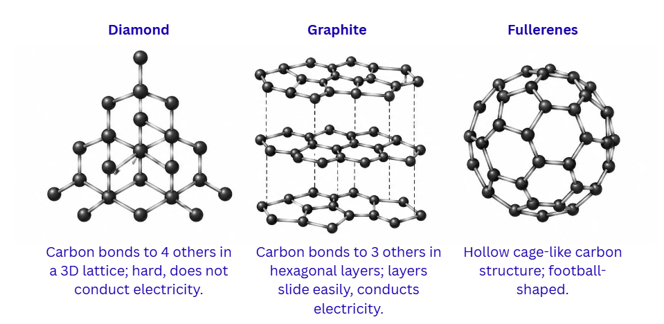

> **Key idea:** Carbon bonds covalently by sharing electrons. Covalent compounds have low melting points and poor conductivity. Carbon's allotropes — diamond, graphite, and fullerenes — demonstrate how atomic arrangement determines properties.

---

## Why Carbon Is So Versatile

Two remarkable properties set carbon apart from every other element:

### 1. Catenation

**Catenation** is carbon's ability to bond with other carbon atoms, forming long chains, branched networks, and closed rings. The C—C bond is exceptionally strong and stable because carbon atoms are small, allowing their nuclei to hold shared electrons tightly.

Silicon, carbon's neighbour in the periodic table, can also form chains — but only up to about 7-8 atoms, and those chains are quite reactive. Carbon chains can extend to hundreds or thousands of atoms, as seen in polymers like polythene.

### 2. Tetravalency

With a **valency of 4**, each carbon atom can form bonds with up to four other atoms simultaneously. These partner atoms can be other carbons, hydrogen, oxygen, nitrogen, sulphur, halogens, and more. This opens up a staggering variety of possible structures.

> **Key idea:** Catenation (forming C—C chains and rings) and tetravalency (bonding with four atoms) together explain why carbon produces millions of compounds — far more than any other element.

---

## Saturated and Unsaturated Carbon Compounds

### Saturated Compounds (Alkanes)

When carbon atoms link only through **single bonds**, the resulting compounds are called **saturated hydrocarbons** or **alkanes**. They tend to be relatively stable and unreactive.

General formula: **CₙH₂ₙ₊₂**

Examples: Methane (CH₄), Ethane (C₂H₆), Propane (C₃H₈), Butane (C₄H₁₀)

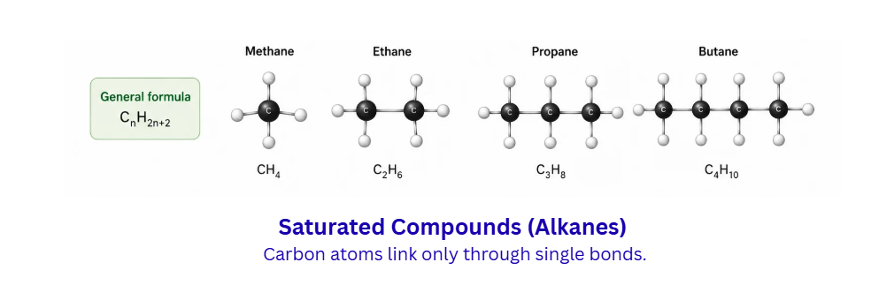

### Unsaturated Compounds

Compounds containing **double bonds** or **triple bonds** between carbon atoms are called **unsaturated hydrocarbons**. They are more chemically reactive than saturated compounds.

- **Alkenes** (one double bond): General formula **CₙH₂ₙ** — Ethene (C₂H₄), Propene (C₃H₆)
- **Alkynes** (one triple bond): General formula **CₙH₂ₙ₋₂** — Ethyne (C₂H₂), Propyne (C₃H₄)

Compounds made exclusively of carbon and hydrogen are collectively termed **hydrocarbons**.

---

## Chains, Branches, and Rings

Carbon compounds take three structural forms:
- **Straight chains** — carbon atoms line up one after another (e.g., n-butane)
- **Branched chains** — one or more carbon atoms branch off the main chain (e.g., isobutane)
- **Rings** — carbon atoms close into a loop (e.g., cyclohexane C₆H₁₂, benzene C₆H₆)

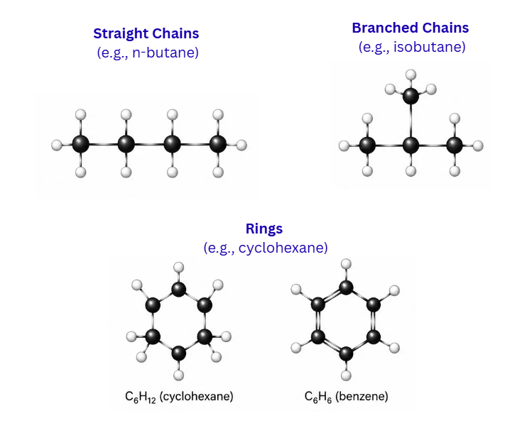

### Structural Isomers

When two compounds share the **same molecular formula** but have **different structural arrangements**, they are called **structural isomers**. For example, C₄H₁₀ can exist as n-butane (a straight chain of 4 carbons) or isobutane (a 3-carbon chain with one methyl branch).

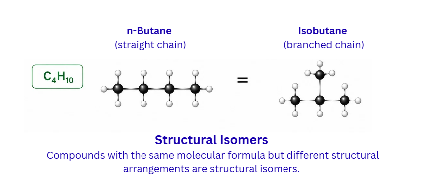

> **Key idea:** Carbon compounds exist as straight chains, branched chains, and rings. Structural isomers have identical formulae but different atom arrangements, leading to different physical properties.

---

## Functional Groups

When one or more hydrogen atoms in a hydrocarbon are replaced by atoms like chlorine, oxygen, or nitrogen (called **heteroatoms**), the compound gains a **functional group** — a specific cluster of atoms that determines its chemical behaviour.

Important functional groups for Class 10:

| Functional Group | Compound Class | Example |
|---|---|---|
| —Cl, —Br | Haloalkane | Chloromethane (CH₃Cl) |
| —OH | Alcohol | Ethanol (C₂H₅OH) |
| —CHO | Aldehyde | Methanal (HCHO) |
| —CO— | Ketone | Propanone (CH₃COCH₃) |
| —COOH | Carboxylic acid | Ethanoic acid (CH₃COOH) |

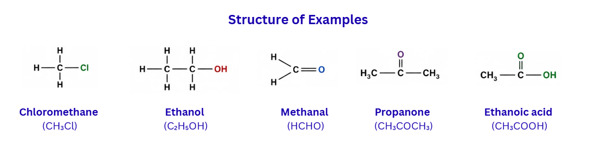

> **Key idea:** Functional groups are the chemically active parts of carbon compounds. They determine how a compound reacts, regardless of the length of the carbon chain attached to them.

---

## Homologous Series

A **homologous series** is a family of compounds sharing the same functional group, where each member differs from the next by exactly one **—CH₂—** unit (adding 14 atomic mass units).

Characteristics:
- Common general formula
- Identical functional group
- Similar chemical reactions
- Gradual, predictable change in physical properties (boiling point, melting point) with increasing chain length
- Each successive member adds CH₂ (14 u)

Example — the alkanol (alcohol) series: CH₃OH (methanol) → C₂H₅OH (ethanol) → C₃H₇OH (propanol) → C₄H₉OH (butanol)

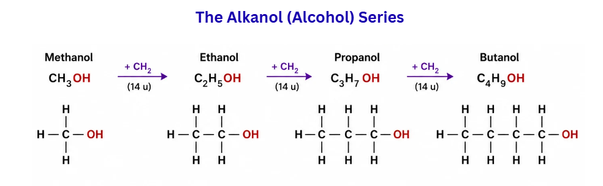

---

## Naming Carbon Compounds — IUPAC Nomenclature

The International Union of Pure and Applied Chemistry (IUPAC) provides a systematic naming method:

1. **Count the carbon atoms** in the longest continuous chain to determine the root word:
   1C = meth-, 2C = eth-, 3C = prop-, 4C = but-, 5C = pent-, 6C = hex-
2. **Identify the functional group** — it gives the suffix (or prefix):
   -ol for alcohol, -al for aldehyde, -one for ketone, -oic acid for carboxylic acid
3. **For unsaturated compounds**, replace '-ane' with '-ene' (double bond) or '-yne' (triple bond)
4. If the suffix starts with a vowel, drop the terminal 'e' from the root name

Examples: Propan-1-ol (3 carbons + alcohol), Ethanal (2 carbons + aldehyde), But-2-ene (4 carbons + double bond at position 2)

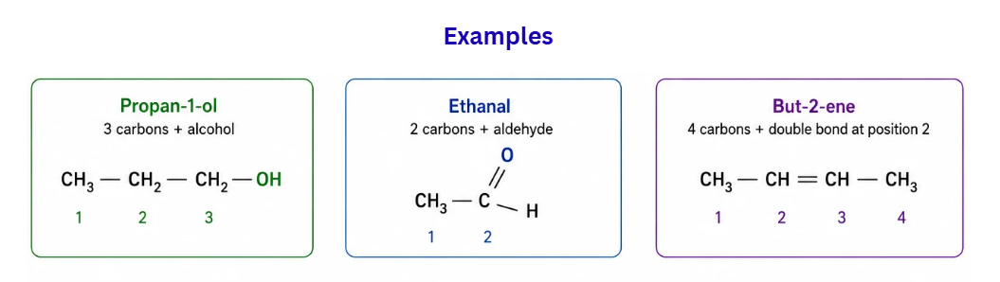

> **Key idea:** IUPAC names are built from the carbon count (root) plus the functional group (suffix/prefix), creating a systematic and unambiguous naming system.

---

## Chemical Properties of Carbon Compounds

### Combustion

Carbon compounds burn in oxygen to release **heat and light**:
- CH₄ + 2O₂ → CO₂ + 2H₂O + heat and light
- C₂H₅OH + 3O₂ → 2CO₂ + 3H₂O + heat and light

**Saturated hydrocarbons** burn with a **clean blue flame** (complete combustion). **Unsaturated hydrocarbons** often burn with a **yellow, smoky flame** because the higher carbon-to-hydrogen ratio leads to incomplete combustion, depositing soot (unburnt carbon).

If the bottom of your cooking vessel turns black, it means the fuel (LPG, kerosene) is burning incompletely — the air supply to the burner needs adjustment.

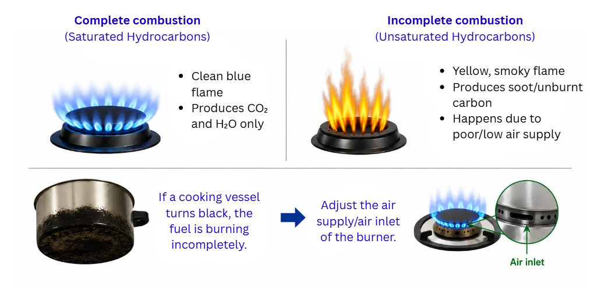

### Oxidation

Alcohols can be converted to **carboxylic acids** using oxidising agents such as **alkaline KMnO₄** (potassium permanganate) or **acidified K₂Cr₂O₇** (potassium dichromate):

Ethanol → Ethanoic acid (an oxygen atom is added)

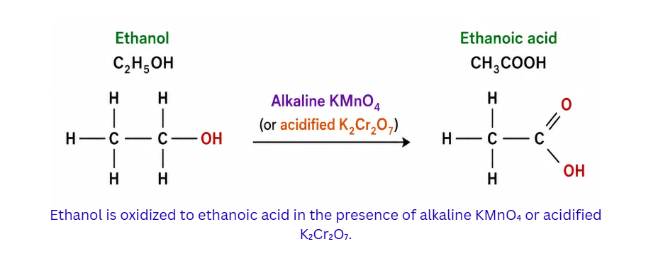

### Addition Reaction

**Unsaturated compounds** react with hydrogen gas in the presence of a catalyst (nickel or palladium) — the hydrogen adds across the double or triple bond, converting the compound to a saturated one. This is called **hydrogenation**.

Industrial application: Converting liquid **vegetable oils** (unsaturated) into solid **vanaspati ghee** (saturated) through hydrogenation. This is why vanaspati ghee is solid at room temperature while mustard oil remains liquid.

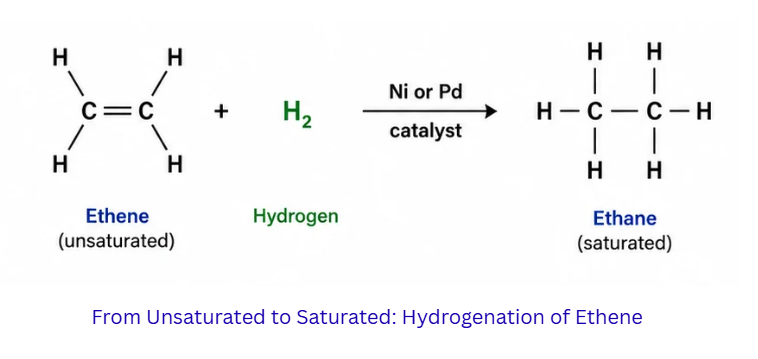

### Substitution Reaction

**Saturated hydrocarbons** undergo substitution — an atom (usually hydrogen) is replaced by another atom (often chlorine) in the presence of **sunlight**:

CH₄ + Cl₂ →(sunlight) CH₃Cl + HCl

Further substitution can replace additional hydrogen atoms with chlorine.

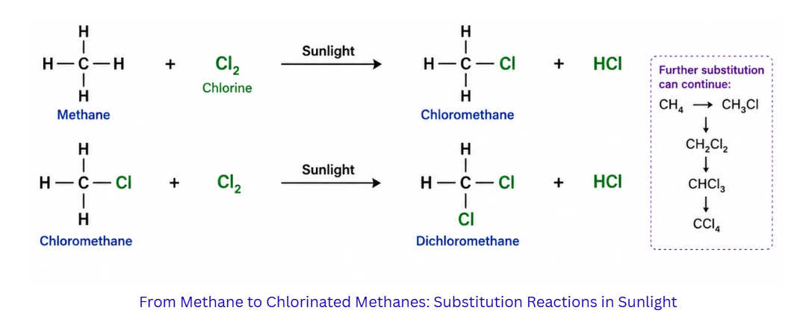

> **Key idea:** Carbon compounds undergo combustion (burning), oxidation (alcohol → acid), addition reactions (unsaturated + H₂ → saturated), and substitution reactions (saturated + Cl₂, with sunlight).

---

## Ethanol — Properties and Reactions

**Ethanol (C₂H₅OH)** is a colourless liquid with a characteristic smell. It mixes completely with water and is the alcohol found in beverages. It serves as a solvent in medicines (tincture of iodine, cough preparations) and is increasingly used as a fuel additive — India now blends up to 20% ethanol with petrol.

### Key Reactions

**With sodium metal:** 2Na + 2C₂H₅OH → 2C₂H₅ONa (sodium ethoxide) + H₂↑

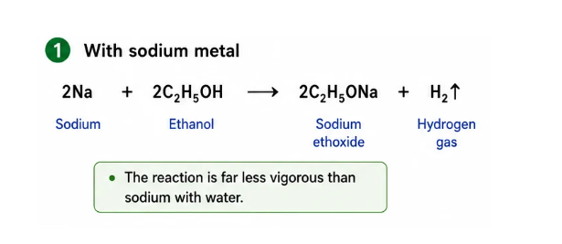
The reaction is far less vigorous than sodium with water.

**Dehydration:** Heating ethanol with concentrated H₂SO₄ at 443 K removes water, forming ethene:
C₂H₅OH →(conc. H₂SO₄, 443K) CH₂=CH₂ + H₂O
Concentrated sulphuric acid acts as a **dehydrating agent**.

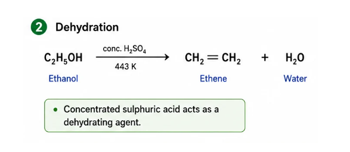

**Health warning:** Consuming large quantities of ethanol is toxic. Methanol (CH₃OH) is even more dangerous — even small amounts can cause permanent blindness or death. **Denatured alcohol** (methylated spirit) is industrial ethanol mixed with methanol and a dye to make it undrinkable.

---

## Ethanoic Acid — Properties and Reactions

**Ethanoic acid (CH₃COOH)** — also known as acetic acid — is the simplest carboxylic acid with wide usage. A 5-8% water solution of ethanoic acid is **vinegar**, used in Indian cooking for pickles and chutneys. Pure ethanoic acid freezes at 290 K (about 16.6°C) into ice-like crystals, earning it the name **glacial acetic acid**.

Carboxylic acids are **weak acids** — they ionise only partially in water, unlike strong mineral acids such as HCl.

### Key Reactions

**Esterification:** When ethanoic acid reacts with ethanol in the presence of an acid catalyst, it produces an **ester** and water. Esters have characteristically sweet, fruity odours and are used in perfumes and food flavourings.

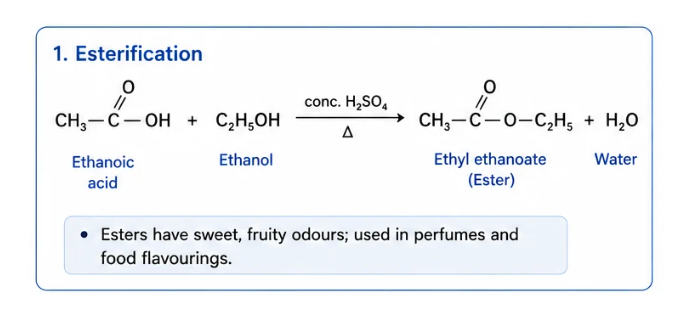

**Saponification:** The reverse process — an ester reacts with NaOH to produce an alcohol and the sodium salt of the acid. This is the fundamental reaction behind **soap making**.

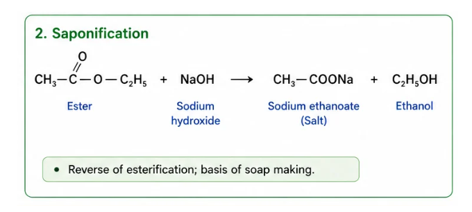

**With bases:** CH₃COOH + NaOH → CH₃COONa + H₂O (neutralisation)

**With carbonates:** 2CH₃COOH + Na₂CO₃ → 2CH₃COONa + H₂O + CO₂↑ (effervescence test for carboxylic acids)

> **Key idea:** Ethanol and ethanoic acid are commercially vital carbon compounds. Esterification (acid + alcohol → ester) and saponification (ester + NaOH → soap) are important reversible reactions.

---

## Soaps and Detergents

### How Soap Works

**Soap** is the sodium or potassium salt of a long-chain fatty acid (like stearic acid or palmitic acid). Each soap molecule has a dual personality:
- A **hydrophilic** (water-loving) ionic head
- A **hydrophobic** (water-repelling) long hydrocarbon tail

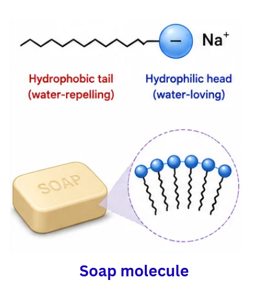

### The Micelle Mechanism

When you lather soap onto a greasy plate, the hydrophobic tails burrow into the grease while the hydrophilic heads face the surrounding water. Many soap molecules arrange themselves into a spherical cluster called a **micelle**, trapping the grease droplet inside. When you rinse with water, the micelles — with their oily cargo trapped inside — wash away.

Scrubbing or agitating (as in a washing machine) helps break oily dirt loose from surfaces, enabling more micelles to form.

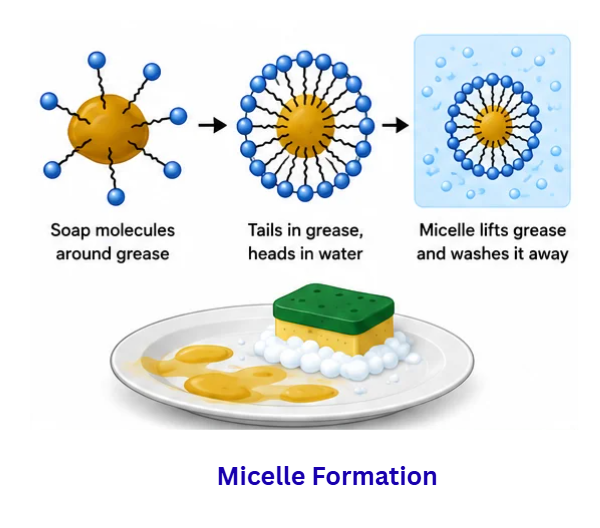

### Why Soap Fails in Hard Water

**Hard water** contains dissolved calcium (Ca²⁺) and magnesium (Mg²⁺) ions. These ions react with soap to produce an insoluble, sticky residue called **scum** — wasting soap and leaving a film on clothes and utensils.

### Detergents — The Hard Water Solution

**Detergents** are synthetic cleaning agents (sodium salts of sulphonic acids or long-chain ammonium compounds). They clean by the same micelle mechanism as soap but do **not** form scum with hard water ions. This makes detergents effective in all water types.

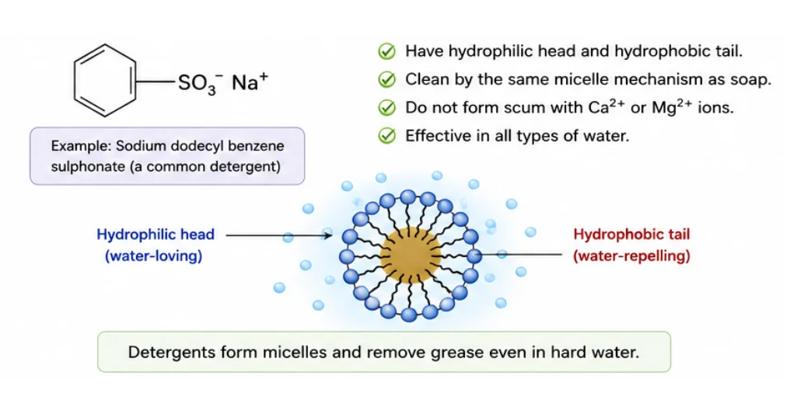

Because detergents work equally well in hard and soft water, you **cannot** use a detergent to test whether water is hard. Only soap can make that distinction — less foam and visible scum indicate hard water.

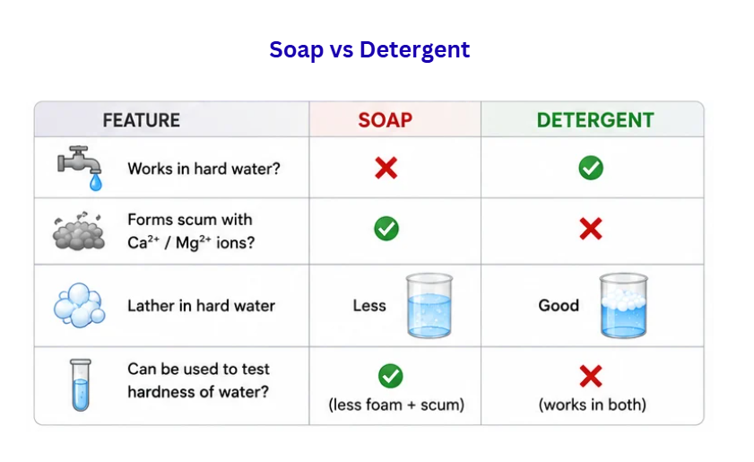

> **Key idea:** Soaps clean through micelle formation that traps grease. Soap is ineffective in hard water (forms scum), but detergents work in both hard and soft water because they do not form insoluble precipitates with Ca²⁺ and Mg²⁺.

---

## Apply What You Have Learned

### Where you see this in real life

**The ethanol-blended petrol programme — BPCL, IOCL, HPCL.** Look at the sticker on the pump next time you fill petrol. It probably says E10 or E20 — meaning 10% or 20% ethanol blended with petrol. The ethanol comes from sugarcane molasses, distilled at BPCL and IOCL units in Maharashtra, Uttar Pradesh, and Karnataka. India aims to hit 20% blending across the country by 2025. Every kilometre your school bus drives on E20 is your textbook combustion reaction, scaled to a national fuel policy.

**Vanaspati ghee — the Dalda factories.** Mustard, sunflower, and palm oils are unsaturated and liquid. Factories like Mother Dairy's edible oil units and the historic Hindustan Unilever Dalda plant bubble hydrogen gas through these oils at around 175°C in the presence of a nickel catalyst. The double bonds become single bonds and the oil becomes solid vanaspati. The kitchen ingredient on every middle-class shelf is a single addition reaction repeated millions of times — straight out of Chapter 4.

**Indian pharma — Sun Pharma, Cipla, Dr. Reddy's, Aurobindo, Lupin.** India is the world's largest exporter of generic medicines, worth over Rs. 2 lakh crore annually. Every active pharmaceutical ingredient is an organic compound with a specific functional group — usually a hydroxyl, carboxylic acid, ester, or amide. Paracetamol has a hydroxyl AND an amide. Aspirin is an ester of salicylic acid. The medicines that treat your fever and infection were designed by chemists using the same functional-group logic you are learning here, just at a much deeper level.

### Do it yourself — the carbon compound household audit

Carbon compounds run almost every product in your home. Find **10 household items** and identify which type of carbon compound is inside them. Use the chart below as a starting point and dig deeper.

**Items to audit:**

1. **Cooking gas (LPG)** — saturated hydrocarbon (alkane: propane + butane)
2. **Vinegar (sirka)** — carboxylic acid (ethanoic acid)
3. **Nail polish remover** — ester or ketone (often acetone, a ketone)
4. **A bottle of mustard or groundnut oil** — unsaturated fatty acid (triglyceride with C=C bonds)
5. **A bar of soap** — sodium salt of long-chain fatty acid
6. **Surf or Tide detergent powder** — sodium salt of sulphonic acid
7. **Tincture of iodine (in the first-aid box)** — ethanol-based solution
8. **A plastic bottle or carry bag** — long polymer chain (polythene)
9. **Vanaspati ghee** — saturated fatty acid (hydrogenated from unsaturated)
10. **Wood, paper, or cotton** — cellulose (long carbon-chain polymer)

For each item, write the carbon compound class, the functional group if any, and the property of the compound that makes it useful for that purpose. For instance: vinegar contains ethanoic acid, has the —COOH functional group, weakly acidic and food-safe, which is why it preserves pickles.

*⏱ 45 minutes audit + 30 minutes writing · 🧹 Low — no chemistry, just label-reading and notebook work · 👨‍👩‍👧 Adult permission to handle nail polish remover and gas cylinder labels*

> **Show what you found:** Snap a photo of all 10 items lined up. Sketch the structural formula of three of them in your notebook (LPG, vinegar, and any ester you found). Show your dadu or mummy — they have been using all of these for years without knowing the chemistry. Tell them one new thing you understood, like why mustard oil stays liquid but vanaspati ghee is solid, or why a Surf packet works in borewell water but a soap bar makes scum. Ask them if they can guess what is inside the body lotion or the mosquito repellent.

> **A question to keep asking all year:** *Every plastic, fuel, fibre, food, fragrance, and medicine I touch — which functional group is sitting at its core, and how would the product change if that group were swapped for another?*
