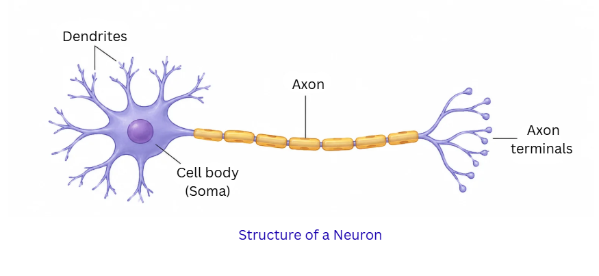
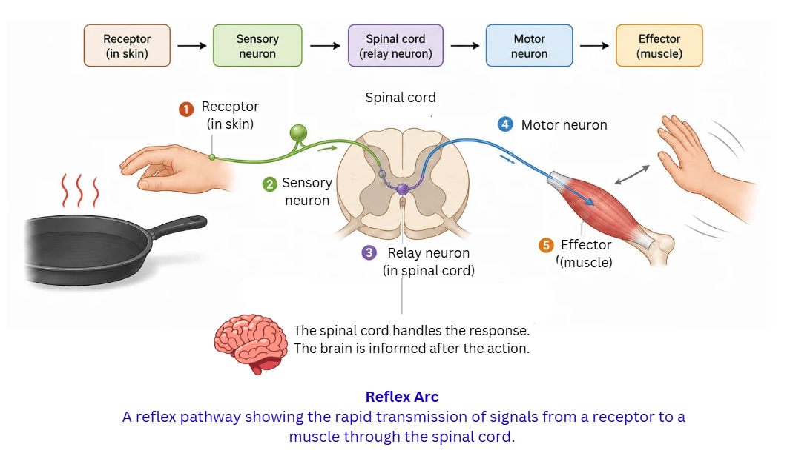
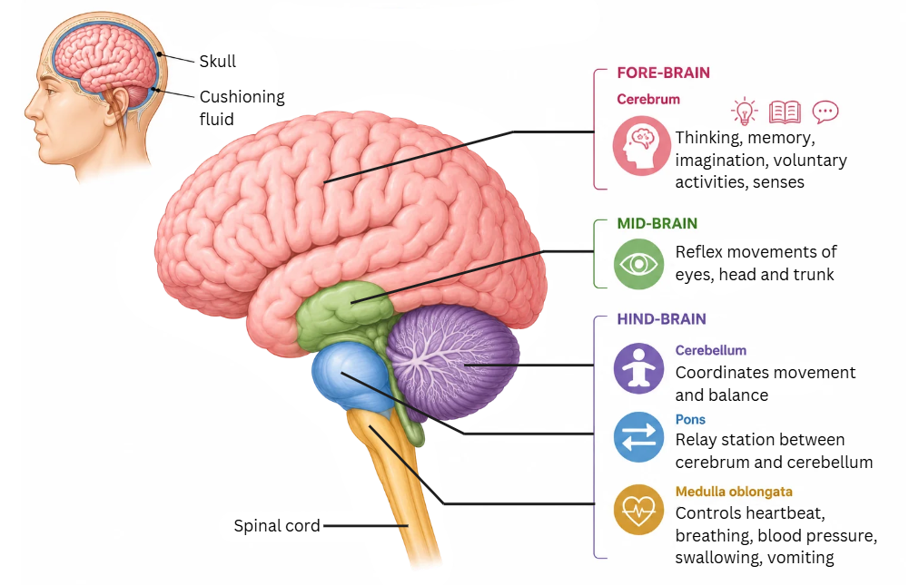

## Introduction

Every living creature must sense what is happening around it and respond appropriately. Imagine you are walking barefoot and step on a sharp stone — your foot lifts instantly. Or consider a sunflower slowly turning its face towards the sun through the day. Both situations show organisms detecting changes and reacting to them. The systems responsible for this are called **control and coordination** systems. Animals rely on two main systems — the **nervous system** (for quick responses) and the **endocrine system** (for slower, sustained regulation). Plants, lacking nerves, depend on special chemicals called **phytohormones**.

> **Key idea:** Organisms need control and coordination to detect environmental changes and respond to them. Nervous signals act rapidly, while hormonal signals provide gradual, long-lasting effects.

---

## The Nervous System in Animals

### Structure of a Neuron

The **neuron** is the building block of the entire nervous system. Think of it as a tiny wire that carries messages across the body. Each neuron has distinct parts:

- **Dendrites** — tree-like branches at one end that pick up signals from the surroundings or from neighbouring neurons
- **Cell body (soma)** — the central part housing the nucleus, which keeps the neuron alive and processes incoming signals
- **Axon** — a long, cable-like extension that carries the processed signal away from the cell body towards the next neuron or towards a muscle or gland
- **Axon terminals** — tiny branched endings at the far end of the axon that pass the message forward

Our sense organs house special signal-detecting cells called **receptors**:
- **Taste receptors** on the tongue detect flavours in your maa's rajma chawal
- **Smell receptors** in the nose detect aromas like fresh jasmine garlands
- **Light receptors** in the eyes detect brightness and colour

### How a Nerve Signal Travels

When a receptor picks up a stimulus, a chemical change at the dendrite tip generates a tiny electrical pulse. This pulse races through the cell body and along the axon like a spark travelling along a fuse. When the pulse reaches the axon terminal, it triggers the release of special chemicals called **neurotransmitters** into the narrow gap between two neurons. This gap is the **synapse**. The neurotransmitters float across, land on the next neuron's dendrite, and spark a fresh electrical pulse there. The signal thus hops from neuron to neuron in an electrochemical chain.

> **Key idea:** Nerve signals travel as electrical pulses within a neuron and are passed between neurons by chemical neurotransmitters at synapses.

---

## Reflex Actions and the Reflex Arc

Imagine you accidentally touch a hot tawa in the kitchen. Your hand jerks back even before you consciously feel the burn. This instantaneous, automatic response is a **reflex action** — it does not wait for the brain's permission.

The route a reflex signal follows is called a **reflex arc**:

**Receptor (in skin) → Sensory neuron → Spinal cord (relay neuron) → Motor neuron → Effector (muscle)**

The **spinal cord** handles the entire decision. The brain finds out only after the hand has already moved away. This shortcut saves precious moments that could prevent a severe burn or injury.

Other everyday examples: your eyelids shutting when a bug flies at your face, your knee jerking when a doctor taps below the kneecap, or pulling your foot away when you step on a thorn while walking in a park.

> **Key idea:** Reflex actions are ultra-fast, involuntary responses managed by the spinal cord through a reflex arc, protecting the body before the brain even registers the danger.

---

## The Human Brain

The **brain** is the supreme command centre of the body. It sits securely inside the bony **cranium** (skull) and is cushioned by a layer of fluid that absorbs shocks — much like bubble wrap protects a fragile parcel.

### Regions of the Brain

**Fore-brain:**
- **Cerebrum** — the largest and most wrinkled part. It is the seat of thinking, reasoning, memory, imagination, and all voluntary activities like writing, speaking, or solving a maths problem. Separate zones within the cerebrum handle sight, hearing, smell, taste, and touch.

**Mid-brain:**
- A compact region connecting fore-brain and hind-brain. It manages certain involuntary reflex movements of the eyes, head, and trunk — for instance, turning your head towards a sudden loud sound.

**Hind-brain:**
- **Cerebellum** — the coordination expert. It ensures your movements are smooth and balanced. Riding a bicycle through a crowded Jaipur lane, catching a cricket ball, or threading a needle — all need the cerebellum.
- **Medulla oblongata** — the life-support unit. It silently regulates heartbeat, breathing rhythm, blood pressure, swallowing, and vomiting. It also links the brain to the spinal cord.
- **Pons** — acts as a relay station, ferrying messages between the cerebrum and cerebellum.

### The Spinal Cord

The **spinal cord** is a long, rope-like bundle of nerves running inside the backbone (vertebral column). It serves two roles:
1. It is the highway connecting the brain to every part of the body below the neck.
2. It independently handles reflex actions.

If the spinal cord is damaged at any point, signals cannot pass above or below that point. This can lead to loss of movement and sensation in the affected parts, and also loss of reflexes below the injury.

> **Key idea:** The brain has specialised regions — the cerebrum for thinking, the cerebellum for balance, and the medulla for vital involuntary functions. The spinal cord relays signals and controls reflexes.

---

## Classifying Actions

| Type | Controller | Examples |
|---|---|---|
| **Voluntary** | Cerebrum | Writing an exam, playing tabla, picking up a glass of chai |
| **Involuntary** | Medulla oblongata | Heartbeat, breathing, digestion (peristalsis) |
| **Reflex** | Spinal cord | Pulling hand from fire, sneezing, blinking at bright light |

Both involuntary actions and reflex actions happen without conscious thought. The key distinction is where the control lies: involuntary actions are governed by the medulla in the brain, while reflexes are managed by the spinal cord.

> **Key idea:** Voluntary actions are consciously directed by the cerebrum. Involuntary actions are run by the medulla. Reflex actions are handled by the spinal cord.

---

## How Plants Coordinate Without Nerves

Plants have no nervous system, yet they respond beautifully to their surroundings. They achieve coordination through **plant hormones (phytohormones)** and changes in cell water content.

### Movement Not Linked to Growth (Nastic Movements)

Touch the leaves of a **chhui-mui** plant (Mimosa pudica) and they fold shut almost instantly. This is not growth — it is caused by a rapid loss of water (turgor pressure) from cells at the base of the leaflets. The cells shrink, the leaf droops, and after some time the water refills and the leaves open again.

### Movement Linked to Growth (Tropic Movements)

These are directional growth responses triggered by an external stimulus. They occur because plant hormones distribute unevenly, causing one side to grow faster than the other.

| Tropism | Stimulus | Example |
|---|---|---|
| **Phototropism** | Light | A shoot bends towards a window; roots bend away from light |
| **Geotropism** | Gravity | Roots grow downward; shoots grow upward |
| **Hydrotropism** | Water | Roots curve towards a moist region in soil |
| **Chemotropism** | Chemical | The pollen tube grows towards the ovule guided by chemical signals |
| **Thigmotropism** | Touch | Tendrils of a bottle gourd or pea plant coil around a bamboo support |

### Major Plant Hormones

| Hormone | What It Does |
|---|---|
| **Auxin** | Drives cell elongation; responsible for phototropism — it gathers on the shaded side, making those cells stretch more, so the stem bends toward light |
| **Gibberellins** | Stimulate stem lengthening and trigger flowering |
| **Cytokinins** | Speed up cell division; abundant in fruits and seeds |
| **Abscisic acid (ABA)** | Puts the brakes on growth; promotes leaf fall and dormancy under stress |
| **Ethylene** | A gas that hastens fruit ripening — this is why a ripe banana placed near raw mangoes speeds up their ripening |

> **Key idea:** Plants coordinate using hormones. Auxin's unequal distribution causes stems to bend towards light (phototropism). Other hormones regulate growth, flowering, fruit ripening, and stress responses.

---

## The Hormonal System in Animals (Endocrine System)

While nerves deliver instant messages, the body also needs a slower postal service for long-term regulation. The **endocrine glands** perform this role by secreting **hormones** directly into the bloodstream. Hormones travel through the blood and instruct specific target organs.

### Key Glands and Their Hormones

| Gland | Hormone | Role |
|---|---|---|
| **Pituitary** (master gland, pea-sized, in the brain) | Growth hormone | Governs overall body growth; too little in childhood causes dwarfism, too much causes gigantism |
| **Thyroid** (butterfly-shaped, in the neck) | Thyroxin | Controls the rate at which the body burns carbohydrates, fats, and proteins for energy |
| **Pancreas** (behind the stomach) | Insulin | Lowers blood sugar by directing cells to absorb glucose and store it as glycogen |
| **Adrenal** (cap-like glands atop each kidney) | Adrenaline | The "emergency hormone" — speeds up heartbeat, raises blood pressure, quickens breathing, prepares muscles for action |
| **Testes** (in males) | Testosterone | Triggers development of male features at puberty — facial hair, deeper voice, broader shoulders |
| **Ovaries** (in females) | Oestrogen | Triggers development of female features at puberty — breast development, wider hips, menstrual cycle regulation |

### Important Health Connections

- **Iodine** is a must for making thyroxin. People in hilly regions of India, where soil iodine is low, sometimes develop **goitre** (a visible swelling in the neck) due to an overworked, enlarged thyroid. This is why iodised salt (like Tata Salt) is promoted across the country.
- When the pancreas does not produce enough **insulin**, blood sugar rises uncontrollably — a condition called **diabetes**. India has one of the highest diabetes populations in the world, making awareness of this hormonal disorder critical.
- **Adrenaline** floods the blood when you face sudden danger — say a stray dog charges at you while cycling. Your heart pounds, breathing quickens, and muscles tense — all preparing you to fight or run.

### How the Body Keeps Hormones in Check — Feedback Mechanism

Hormone levels are finely tuned by feedback loops. Consider blood sugar: after you eat a plate of chole bhature, glucose floods into the blood. The pancreas senses this spike and releases more insulin, which helps cells absorb glucose and bring levels down. Once blood sugar drops to normal, insulin secretion reduces. This self-correcting cycle keeps the body balanced.

### Comparing Nervous and Hormonal Control

| Feature | Nervous System | Endocrine System |
|---|---|---|
| Speed | Lightning-fast (milliseconds) | Gradual (minutes to hours) |
| Duration | Brief and stops quickly | Prolonged and sustained |
| Medium | Electrical impulses along nerve fibres | Chemical hormones through the bloodstream |
| Target | Specific — one muscle or one gland | Broad — can affect many organs at once |
| Precision | Highly localised | More general and widespread |

> **Key idea:** The endocrine system uses hormones for slow, lasting coordination. Feedback mechanisms prevent over- or under-production of hormones. Nervous and hormonal systems complement each other to keep the body running smoothly.
