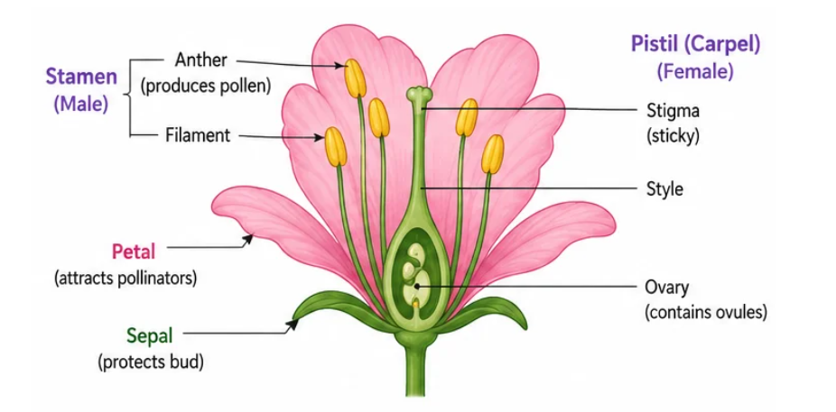

## Introduction — The Purpose of Reproduction

Every organism eventually ages and dies. If living beings only died without producing new ones, life on Earth would vanish. **Reproduction** is the biological process through which organisms generate offspring of their own kind, ensuring the **species continues** to exist.

What makes reproduction especially interesting is the **DNA copying** that lies at its heart. Each time DNA is copied to create a new organism, the copy is not perfectly identical — tiny differences creep in. These slight **variations** matter because they give a population diversity. In a changing environment, some variants may survive better than others, allowing the species to adapt over time.

> **Key idea:** Reproduction is essential not for any single organism's survival, but for the survival of the species. The small errors in DNA copying generate variations that fuel adaptation and evolution.

---

## Asexual Reproduction — One Parent, Many Methods

In **asexual reproduction**, a single organism produces offspring without involving another individual. The young ones are genetically very similar to the parent. This method is common in simpler organisms.

### Fission

- **Binary fission:** The parent cell divides into two roughly equal daughter cells. **Amoeba** splits in any random direction, while **Leishmania** (the organism causing kala-azar) always divides along a fixed orientation due to its specific body structure.
- **Multiple fission:** Under harsh conditions, the parent cell forms a tough outer shell and divides into many daughter cells at once. When conditions improve, they burst out. **Plasmodium** (the malaria parasite) reproduces this way inside red blood cells.

### Fragmentation

Some simple multicellular organisms break apart naturally, and each fragment grows into a complete new organism. **Spirogyra**, a green filamentous alga found in ponds across India, reproduces by fragmentation — a filament breaks into pieces, and each piece regenerates into a full organism.

### Regeneration

Certain organisms can regrow an entire body from a severed part, provided the part contains specialised cells capable of developing into different cell types. **Planaria** (a flatworm) and **Hydra** can regenerate completely from small body fragments. However, regeneration is not the same as reproduction — it is a response to injury. You cannot cut an earthworm into ten pieces and expect ten new earthworms, because most organisms lack such specialised regenerative cells.

### Budding

A small bulge or **bud** develops on the parent organism, gradually grows, and eventually pinches off as a new independent individual. **Hydra** and **yeast** both reproduce by budding. In yeast, you can sometimes see chains of buds still attached to the parent cell.

### Vegetative Propagation

New plants arise from vegetative parts — stems, roots, or leaves — without the involvement of seeds. Indian farmers use this extensively:
- **Stem cuttings:** Sugarcane is planted by burying stem pieces with nodes in the field. Rose bushes are also grown from cuttings.
- **Tubers:** Potatoes sprout from the "eyes" (buds) on the tuber. Each eye can produce a new plant.
- **Roots:** Sweet potato and dahlia produce new plants from their root tubers.
- **Leaves:** Bryophyllum (known as patharchata in Hindi) has tiny buds along the edges of its leaves. When these fall on moist soil, each bud grows into a new plant.

Advantages: plants flower and fruit earlier than seed-grown plants; desirable traits are perfectly preserved; and plants that have lost the ability to set seeds can still be multiplied.

### Spore Formation

Organisms like **Rhizopus** (the common bread mould you see on stale roti) produce thousands of tiny spores inside a sac called a **sporangium**. Each spore is wrapped in a protective coat. When the sporangium bursts, spores scatter through the air. Landing on a warm, moist surface, they germinate into new organisms.

> **Key idea:** Asexual reproduction requires just one parent and produces offspring with minimal genetic variation. Methods include fission, fragmentation, regeneration, budding, vegetative propagation, and spore formation.

---

## Sexual Reproduction — Two Parents, Greater Variety

**Sexual reproduction** involves two parents — one male, one female — each contributing specialised reproductive cells called **gametes**. The male gamete and female gamete fuse together in a process called **fertilisation**, forming a single cell (the **zygote**) that develops into a new individual.

### Why Does This Matter?

Because each offspring receives DNA from two different individuals, the genetic combinations are vast. No two siblings (except identical twins) are exactly alike. This diversity is the raw material for **natural selection** — nature's way of favouring traits that help organisms survive changing conditions.

> **Key idea:** Sexual reproduction combines DNA from two parents, generating far greater genetic variation than asexual reproduction. This variation is the engine of evolution.

---

## Sexual Reproduction in Flowering Plants

### Parts of a Flower

A typical flower is built in four rings of parts:

- **Sepals** — the outermost green leaf-like parts that protect the bud before it opens (together called the calyx)
- **Petals** — the colourful parts that attract bees, butterflies, and other pollinators (together called the corolla)
- **Stamens** — the male reproductive organs, each consisting of a thin **filament** topped by an **anther** that produces **pollen grains** (carrying male gametes)
- **Pistil (carpel)** — the female reproductive organ with three parts: the sticky **stigma** at the top (receives pollen), the slender **style** (a connecting tube), and the **ovary** at the base (holds **ovules** containing female gametes)

A flower having both stamens and pistil is called **bisexual** (e.g., hibiscus, mustard). A flower having only one of the two is called **unisexual** (e.g., papaya — male and female flowers on separate trees; watermelon — separate male and female flowers on the same vine).

### Pollination

**Pollination** is the transfer of pollen grains from the anther to the stigma.
- **Self-pollination:** Pollen lands on the stigma of the same flower or another flower on the same plant.
- **Cross-pollination:** Pollen travels from one plant to the stigma of a different plant of the same species. Agents like wind, water, bees, butterflies, and birds assist in this. Cross-pollination introduces more genetic variation.

### Fertilisation and Seed Formation

Once a pollen grain sticks to the stigma, it germinates and grows a tube — the **pollen tube** — that pushes through the style until it reaches an ovule inside the ovary. The male gamete travels down this tube and fuses with the female gamete (egg cell) inside the ovule. This fusion is **fertilisation**.

After fertilisation:
- The **zygote** divides repeatedly to become an **embryo**
- The **ovule** hardens into a **seed** (which houses the embryo and stored food)
- The **ovary** swells and ripens into a **fruit** (which encloses and protects the seeds)

This is why every mango, apple, or tomato you eat is actually a ripened ovary containing seeds.

> **Key idea:** Pollination delivers pollen to the stigma. Fertilisation fuses male and female gametes inside the ovule. The ovule becomes a seed, and the ovary becomes a fruit.

---

## Reproduction in Human Beings

### Changes at Puberty

**Puberty** marks the period when the reproductive system matures. Hormones trigger a range of physical changes:

In boys (driven by **testosterone**): facial hair appears, the voice deepens, shoulders broaden, body hair grows
In girls (driven by **oestrogen**): breasts develop, hips widen, body hair grows, menstruation begins

### Male Reproductive System

- **Testes** — paired organs located outside the body cavity in a pouch called the **scrotum** (sperm production requires a temperature slightly below body temperature). They produce millions of **sperms** (male gametes) and secrete **testosterone**.
- **Vas deferens** — a tube carrying sperms from the testes upward to the urethra
- **Seminal vesicles and prostate gland** — produce a nutritious fluid (seminal fluid) that nourishes sperms and helps them swim
- **Urethra** — the common passage for both sperms (during reproduction) and urine (during excretion)
- **Penis** — the organ that delivers sperms into the female reproductive tract

### Female Reproductive System

- **Ovaries** — paired organs that produce one **egg** (female gamete) approximately every month (this release is called **ovulation**) and secrete **oestrogen**
- **Fallopian tubes (oviducts)** — tubes that carry the egg from the ovary towards the uterus; fertilisation typically occurs here
- **Uterus (womb)** — a muscular, elastic organ where the fertilised egg implants and develops into a baby
- **Vagina** — the canal that receives sperms and also serves as the birth canal

### Fertilisation, Implantation, and Development

Fertilisation takes place in the **fallopian tube**. The resulting zygote begins dividing and travels to the uterus, where it embeds itself into the thick, blood-rich uterine lining. This embedded ball of cells is now an **embryo**. Over time, the embryo develops distinct organs and is then called a **foetus**.

The **placenta** is a disc-shaped organ that develops at the site where the embryo attaches to the uterine wall. It has finger-like projections (villi) that dip into the mother's blood supply, creating a large surface area for exchange. Oxygen and glucose pass from the mother to the foetus, while carbon dioxide and waste travel in the opposite direction. The mother's blood and the baby's blood never mix directly.

After approximately **nine months** of development, rhythmic contractions of the uterus push the baby out through the vagina — this is childbirth.

### Menstruation

Each month, the uterus prepares a thick, spongy, blood-vessel-rich lining in anticipation of a fertilised egg. If no fertilisation occurs, the egg disintegrates and this lining is no longer needed. It breaks down and is expelled from the body through the vagina as blood and tissue — a process called **menstruation**. The cycle repeats roughly every 28 days and typically lasts 3 to 7 days.

> **Key idea:** The male system produces and delivers sperms. The female system produces eggs, provides the site for fertilisation, and nurtures the developing baby. Menstruation is the monthly shedding of the uterine lining when pregnancy does not occur.

---

## Reproductive Health

Managing reproduction responsibly is an important aspect of health. **Contraceptive methods** help prevent unwanted pregnancies:

1. **Barrier methods** — Condoms (for males or females) physically block sperms from reaching the egg. They are the only method that also reduces the risk of **sexually transmitted diseases (STDs)**.
2. **Hormonal methods** — Oral pills taken regularly alter hormonal balance to prevent the release of eggs. They may have side effects and require medical guidance.
3. **Intrauterine devices (IUDs)** — A small device like the **Copper-T** is placed inside the uterus by a doctor. It prevents the embryo from implanting. It does **not** protect against STDs.
4. **Surgical methods** — **Vasectomy** (in males) involves blocking or cutting the vas deferens. **Tubectomy** (in females) involves blocking or cutting the fallopian tubes. Both are permanent procedures.

**Sexually transmitted diseases** include bacterial infections like gonorrhoea and syphilis, and viral infections like genital warts and HIV-AIDS. Using condoms consistently is the most accessible way to reduce transmission risk.

> **Key idea:** Multiple contraceptive options exist, each working at a different stage of the reproductive process. Only barrier methods (condoms) offer protection against sexually transmitted diseases.
