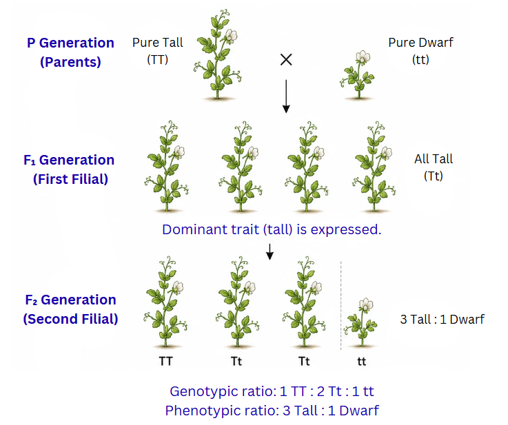
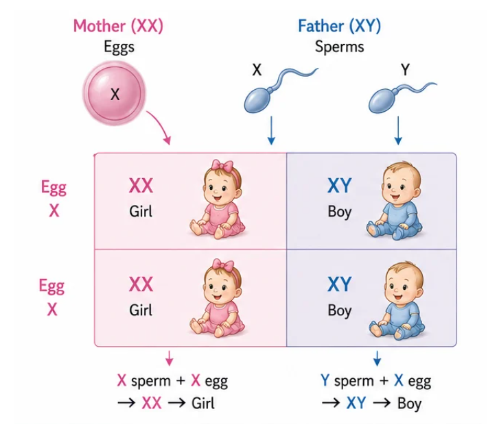

## Introduction — Why Do Children Resemble Their Parents?

Have you noticed that children often share features with their parents — perhaps their mother's curly hair or their father's tall build? Yet siblings are never perfectly identical (unless they are identical twins). The study of how traits pass from one generation to the next is called **heredity**. The variations that arise during reproduction — through small errors in DNA copying and the mixing of two parents' genetic material — accumulate over generations and are the raw material for **evolution**.

> **Key idea:** Heredity is the transmission of traits from parents to offspring. Variations arising during reproduction accumulate across generations and drive evolutionary change.

---

## Gregor Mendel — The Pioneer of Genetics

**Gregor Johann Mendel** (1822-1884) was an Austrian monk who spent years meticulously studying garden pea plants (*Pisum sativum*) in his monastery garden. His careful observations and mathematical analysis earned him the title "Father of Genetics," though his work was only recognised decades after his death.

### Why Were Pea Plants a Smart Choice?

- They exhibit **clearly distinguishable contrasting traits** — for instance, some plants are tall while others are dwarf, some seeds are round while others are wrinkled
- Pea flowers **naturally self-pollinate**, but can also be **manually cross-pollinated**, giving the experimenter full control
- They grow quickly and produce **large numbers of offspring**, making patterns easier to spot
- Several **independent traits** can be tracked simultaneously

---

## The Monohybrid Cross — Studying One Trait at a Time

Mendel began by crossing plants that differed in a single characteristic. For example, he crossed a **pure tall plant** (TT) with a **pure dwarf plant** (tt):

**First filial generation (F1):** Every single plant was tall. The dwarf trait seemed to vanish completely. Mendel called the visible trait **dominant** (tallness) and the hidden trait **recessive** (dwarfness).

**Second filial generation (F2):** When F1 plants were allowed to self-pollinate, both tall and dwarf plants appeared, in an approximate ratio of **3 tall : 1 dwarf**.

What Mendel realised:
- Each trait is governed by a pair of "factors" (today called **genes**)
- Each parent contributes one factor to the offspring
- The **dominant** factor masks the **recessive** factor when both are present
- The recessive trait does not disappear — it simply stays hidden and can reappear in later generations

### Key Terminology

- **Genotype** — the actual genetic constitution (e.g., TT, Tt, or tt)
- **Phenotype** — the visible appearance (e.g., tall or dwarf)
- **Homozygous** — both gene copies are identical (TT — pure tall, or tt — pure dwarf)
- **Heterozygous** — the two gene copies differ (Tt — tall, but carrying one recessive factor)

In the F2 generation, the genotypic ratio is **1 TT : 2 Tt : 1 tt**, which translates to a phenotypic ratio of **3 tall : 1 dwarf** because both TT and Tt produce the tall appearance.

> **Key idea:** Traits are controlled by gene pairs inherited from both parents. A dominant trait is expressed whenever at least one dominant gene copy is present. The recessive trait appears only when both copies are recessive.

---

## The Dihybrid Cross — Two Traits at Once

Mendel then investigated what happens when two traits are followed simultaneously. He crossed plants having **round yellow seeds** (RRYY) with plants having **wrinkled green seeds** (rryy).

**F1 generation:** All offspring had round yellow seeds — both dominant traits were expressed.

**F2 generation:** Self-pollination of F1 produced four types of offspring in the ratio **9 : 3 : 3 : 1**:
- 9 round yellow (both dominant)
- 3 round green (one dominant, one recessive)
- 3 wrinkled yellow (one recessive, one dominant)
- 1 wrinkled green (both recessive)

The crucial observation was the appearance of **new combinations** — round green and wrinkled yellow — that did not exist in either original parent. This demonstrated that seed shape and seed colour are **inherited independently** of each other. Mendel formulated this as the **Law of Independent Assortment**.

> **Key idea:** Genes for different traits sort into gametes independently. This independent assortment produces new trait combinations in offspring, explaining the 9:3:3:1 ratio in a dihybrid cross.

---

## From Genes to Traits — How It Works

A gene is essentially a set of instructions for building a specific **protein**. Proteins (often enzymes) carry out chemical reactions in cells that determine observable traits.

Consider plant height:
- A functional gene produces an efficient enzyme that promotes the production of growth-promoting substances, resulting in a tall plant.
- A mutated version of the gene produces a less efficient enzyme, resulting in lower growth — a dwarf plant.
- In a heterozygous plant (Tt), the single functional gene copy produces enough enzyme to maintain normal height, which is why the plant appears tall.

### Genes Live on Chromosomes

- Genes are arranged along **chromosomes** — thread-like structures made of DNA, found in the nucleus of every cell.
- Body cells are **diploid** — they carry **two copies** of each chromosome (one inherited from each parent), and therefore two copies of each gene.
- **Gametes** (sperms and eggs) are **haploid** — they carry only **one copy** of each chromosome.
- At fertilisation, a sperm and an egg fuse, restoring the diploid number in the offspring.

Because genes for different traits often sit on different chromosomes, they get shuffled independently into gametes — this is the physical basis for Mendel's Law of Independent Assortment.

> **Key idea:** Genes code for proteins that determine traits. Genes reside on chromosomes. Gametes carry half the chromosome number, and fertilisation restores the full set.

---

## Sex Determination

How is the sex of a newborn determined? The answer varies across the living world:
- In certain reptiles, the **temperature** at which eggs are incubated decides the sex
- Snails can **switch sex** during their lifetime
- In **humans**, sex is determined genetically by **sex chromosomes**

### Human Sex Determination

Humans possess **23 pairs of chromosomes** — 22 pairs of **autosomes** (non-sex chromosomes) and 1 pair of **sex chromosomes**.

- Every **female** has two X chromosomes → **XX**
- Every **male** has one X and one Y chromosome → **XY**

Since a mother is XX, every egg she produces carries an **X** chromosome.
Since a father is XY, his sperms are of two types — half carry **X** and half carry **Y**.

- If an **X-bearing sperm** fertilises the egg → **XX** → the baby is a **girl**
- If a **Y-bearing sperm** fertilises the egg → **XY** → the baby is a **boy**

The probability of a boy or a girl is always **50-50**. The sex of the child is entirely determined by which type of sperm from the father fertilises the egg. No diet, ritual, or other practice can influence this outcome. Understanding this science is important for countering unscientific beliefs and the harmful practice of sex-selective discrimination, which is illegal in India under the PCPNDT Act.

> **Key idea:** In humans, sex is determined by sex chromosomes — XX for female, XY for male. The father's sperm decides the child's sex. The probability is always 50% for each.
