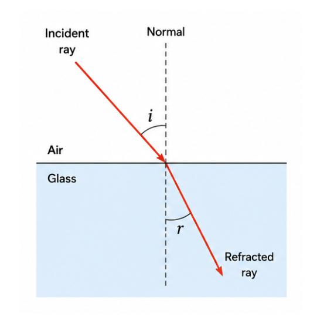
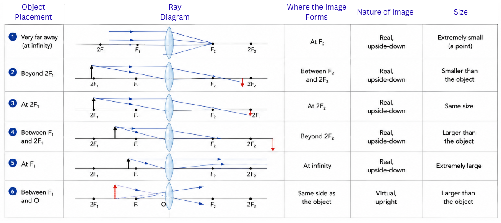

## Introduction

We perceive the world around us largely through light. When light from a source like the sun or a bulb strikes an object, the object sends some of that light into our eyes, allowing us to see it. A key property of light is that it travels in **straight lines** — this is why opaque objects cast sharp-edged shadows and why laser beams appear as narrow, straight streaks.

> **Key idea:** Light travels in straight lines (rectilinear propagation). We see objects because they reflect light into our eyes.

---

## Reflection of Light

When light strikes a smooth, polished surface such as a mirror, it bounces back in a predictable way. This bouncing is called **reflection**. Two fundamental rules govern this process:

1. The **angle of incidence** (the angle between the incoming ray and the normal) is always equal to the **angle of reflection** (the angle between the outgoing ray and the normal): **angle i = angle r**
2. The incoming ray, the outgoing ray, and the normal at the point where light hits the surface all lie in a **single flat plane**

A flat **plane mirror** produces an image that is virtual (cannot be caught on a screen), upright, the same size as the object, and located as far behind the mirror as the object is in front. The image is also laterally inverted — your left hand appears as the right hand in the reflection, which is why ambulance vans print their name in reverse so it reads correctly in a car's rear-view mirror.

---

## Spherical Mirrors

**Spherical mirrors** are mirrors whose reflecting surface is a section of a hollow sphere.

### Two Types

- **Concave mirror:** The reflecting surface curves inward, like the inside of a steel serving bowl. It **converges** parallel light rays to a point.
- **Convex mirror:** The reflecting surface curves outward, like the back of a shiny spoon. It **diverges** parallel light rays so they spread apart.

### Essential Terminology

- **Pole (P):** The geometric centre of the mirror's reflecting face
- **Centre of curvature (C):** The centre of the imaginary sphere from which the mirror is carved
- **Radius of curvature (R):** The radius of that imaginary sphere
- **Principal axis:** A straight line passing through P and C
- **Principal focus (F):** The point where parallel rays meeting the mirror either actually meet (concave) or appear to originate from (convex)
- **Focal length (f):** The distance from P to F. It is exactly half the radius of curvature: **f = R / 2**

### How a Concave Mirror Forms Images

The nature and position of the image depend on where the object is placed:

| Object Placement | Where the Image Forms | Nature of Image | Size |
|---|---|---|---|
| Very far away (at infinity) | At F | Real, upside-down | Extremely small (a point) |
| Beyond C | Between F and C | Real, upside-down | Smaller than the object |
| At C | At C | Real, upside-down | Same size |
| Between C and F | Beyond C | Real, upside-down | Larger than the object |
| At F | At infinity | Real, upside-down | Extremely large |
| Between F and P | Behind the mirror | Virtual, upright | Larger than the object |

### How a Convex Mirror Forms Images

A convex mirror produces only one type of image — always **virtual, upright, and smaller** than the object. The image appears behind the mirror, between P and F. This remains true no matter where the object is placed.

### Everyday Applications

- **Concave mirrors:** Used in shaving mirrors and makeup mirrors (placed close, they magnify the face), dentist's inspection mirrors, vehicle headlamp reflectors (bulb at F produces a parallel beam), and solar concentrators that focus sunlight for heating
- **Convex mirrors:** Used as rear-view and side mirrors on cars and trucks because they always give an upright image and cover a **wider field of view**, helping the driver see more of the road behind

> **Key idea:** Concave mirrors converge light and can produce both real and virtual images depending on object position. Convex mirrors always produce virtual, upright, diminished images and offer a wider view.

---

## Mirror Formula and Magnification

### The Mirror Formula

The relationship between object distance (u), image distance (v), and focal length (f) of a spherical mirror is:

**1/v + 1/u = 1/f**

### Sign Convention (New Cartesian)

All distances are measured from the **pole** of the mirror:
- The direction of incoming light is taken as positive (usually left to right)
- Distances measured opposite to incoming light are negative
- Heights above the principal axis are positive; below are negative

For a concave mirror, f and the focus lie in front of the mirror (on the same side as the object), so **f is negative**. For a convex mirror, the focus is behind the mirror, so **f is positive**.

### Magnification

**m = h' / h = -v / u**

Here h' is the image height and h is the object height. If m is positive, the image is upright (virtual). If m is negative, the image is inverted (real). If |m| > 1, the image is enlarged; if |m| < 1, it is diminished.

> **Key idea:** The mirror formula (1/v + 1/u = 1/f) connects the three key distances. Always apply the sign convention before substituting values. Magnification tells you the image's size and orientation.

---

## Refraction of Light

When light passes from one transparent material into another — say from air into a glass slab — it **changes direction** at the boundary. This bending is called **refraction**. It happens because light travels at different speeds in different materials.

### Laws of Refraction

1. The incoming ray, the refracted ray, and the normal at the point of entry all lie in the **same plane**
2. **Snell's Law:** For a given pair of media, the ratio of the sine of the angle of incidence to the sine of the angle of refraction is a constant. This constant is the **refractive index** (n).

**n = sin i / sin r = speed of light in medium 1 / speed of light in medium 2**

**Key behaviour:**
- Light entering a **denser** medium (e.g., air into water or glass) **slows down** and bends **towards** the normal
- Light entering a **rarer** medium (e.g., glass into air) **speeds up** and bends **away from** the normal

The **refractive index** of a medium tells us how much light slows down in it compared to a vacuum. Water has n approximately 1.33, glass approximately 1.5, and diamond approximately 2.42. Diamond's exceptionally high refractive index is part of why it sparkles so brilliantly.

Everyday examples of refraction: a coin at the bottom of a water-filled bucket appears raised, a straight stick dipped in water looks bent at the surface, and a swimming pool always appears shallower than it actually is.

> **Key idea:** Refraction occurs because light changes speed when moving between different media. It bends towards the normal when entering a denser medium and away from the normal when entering a rarer medium.

---

## Spherical Lenses

### Two Types

- **Convex lens (converging):** Thicker at the centre and thinner at the edges. It brings parallel rays together to a focus.
- **Concave lens (diverging):** Thinner at the centre and thicker at the edges. It spreads parallel rays apart so they appear to come from a focus on the same side as the incoming light.

### Key Terms

- **Optical centre (O):** The central point of the lens; light passing through it goes straight without bending
- **Principal focus (F):** The point where parallel rays converge after passing through a convex lens, or the point from which they appear to diverge after passing through a concave lens
- **Focal length (f):** The distance from O to F

### Image Formation by a Convex Lens

| Object Placement | Where the Image Forms | Nature of Image | Size |
|---|---|---|---|
| Very far away (at infinity) | At F2 | Real, upside-down | Extremely small (a point) |
| Beyond 2F1 | Between F2 and 2F2 | Real, upside-down | Smaller than the object |
| At 2F1 | At 2F2 | Real, upside-down | Same size |
| Between F1 and 2F1 | Beyond 2F2 | Real, upside-down | Larger than the object |
| At F1 | At infinity | Real, upside-down | Extremely large |
| Between F1 and O | Same side as the object | Virtual, upright | Larger than the object |

### Image Formation by a Concave Lens

A concave lens always produces a **virtual, upright, and smaller** image, formed on the same side as the object. This holds true regardless of where the object is placed.

---

## Lens Formula and Power

### The Lens Formula

**1/v - 1/u = 1/f**

Note that this differs from the mirror formula — here we have a **minus** sign between the two terms on the left, not a plus.

### Magnification for Lenses

**m = h' / h = v / u**

(For mirrors, magnification is -v/u; for lenses, it is v/u — a subtle but important difference.)

### Power of a Lens

The **power** of a lens tells us how strongly it converges or diverges light:

**P = 1 / f** (where f is in **metres** and P is in **dioptres**, abbreviated D)

- A convex lens has a **positive** focal length and therefore **positive** power
- A concave lens has a **negative** focal length and therefore **negative** power

When an eye doctor prescribes spectacles with a power of -1.5 D, they are prescribing a concave lens with focal length -0.67 m (about -67 cm), used to correct near-sightedness (myopia). A prescription of +2.0 D means a convex lens with focal length +0.5 m (50 cm), used to correct far-sightedness (hypermetropia).

> **Key idea:** The lens formula (1/v - 1/u = 1/f) relates the three key distances for lenses. The power of a lens (in dioptres) is the reciprocal of focal length (in metres). Positive power means converging; negative means diverging.

---

## Apply What You Have Learned

### Where you see this in real life

**Autorickshaw rearview mirrors all over India.** Every autorickshaw, truck, and bus on Indian roads carries convex mirrors on the side — never plane mirrors, never concave. The reason is exactly what this chapter explains. A convex mirror always produces a virtual, upright, diminished image, and most importantly it covers a much wider field of view than a flat mirror of the same size. The auto driver weaving through Bengaluru traffic can see two lanes of vehicles behind him in one glance. The same optics keeps lakhs of road users safer every day.

**Aravind Eye Hospital and the dioptre prescription.** When your mama or chacha goes to an ophthalmologist — say at Aravind Eye Hospital in Madurai, or LV Prasad in Hyderabad, or any local optician — they walk out with a prescription written in dioptres. Minus values for concave lenses (myopia, near-sightedness). Plus values for convex lenses (hypermetropia, far-sightedness). The simple formula P = 1/f that you are revising for the board exam is the same formula every lens-fitting machine in every optical shop in India uses to grind the glass that helps people see.

**Tessy Thomas and the optics of missile guidance.** Tessy Thomas, the "Missile Woman of India" who led the Agni missile programme, works in a field where precise optics matter at every stage — from the lens systems in tracking cameras to the mirrors in laser-guidance equipment. The sign conventions, the converging-diverging behaviour, the focal length calculations you are practising are the same physics that underlies India's most advanced strategic technology. The chapter is far bigger than the board exam.

### Try it at home — build a pinhole camera and chase the inverted image

*⏱ 45 minutes to build + 30 minutes to test outside · 🧹 light cardboard mess · 👨‍👩‍👧 ask an adult before using scissors or any sharp pin*

**What you'll need:**

- A small cardboard box (a shoebox or a chai-pack carton works perfectly).
- A piece of tracing paper or a thin white sheet.
- Aluminium foil or black chart paper.
- A sharp pin or sewing needle.
- Scissors, tape, a ruler.
- A bright outdoor scene — a tree against the sky, a building, ideally something well-lit.

**Steps:**

1. **Make the screen.** Cut a rectangular hole (about 5 cm × 5 cm) on one short side of the box. Tape tracing paper over the hole from the inside — this is your screen.
2. **Make the aperture.** On the opposite short side, cut another rectangular hole. Tape a piece of aluminium foil (or black paper) over it. Use the pin to make ONE small clean hole right in the centre of the foil. That is your pinhole.
3. **Close the box.** Tape the lid shut so no light leaks in except through the pinhole.
4. **Take it outside.** Point the pinhole side at a brightly lit object — a tree, a building, the sky, a person standing in sunlight. Look at the tracing-paper screen from the open lid side (or cut a small viewing slit).
5. **You should see an inverted, real image on the tracing paper.** Faint, but visible. Move closer and farther — what happens to the image size?
6. **Estimate magnification.** If you know the height of the object and you can measure the height of the image on the screen, calculate m = h'/h. Compare with v/u where v is the box length (object-to-screen distance inside the box) and u is the distance from object to pinhole. You should find m approximately equal to v/u.

**What to look for:**

- The image is INVERTED — top to bottom and left to right. This proves light travels in straight lines through the pinhole.
- The image is REAL — it actually exists on the screen, you can see it without your eye.
- A smaller pinhole gives a sharper but dimmer image. A larger pinhole gives a brighter but blurrier image.
- The image gets larger as you move the camera closer to the object — exactly what u and v predict.

**Show what you found:** Snap a phone photo of the image inside your pinhole camera and show your daadi (or dadu, mummy, or older cousin). Sketch the ray diagram — object on one side, pinhole, inverted image on the screen. Tell them one thing — that this exact principle (light travelling in straight lines, image inversion, and v/u magnification) is how every camera lens, every microscope, every telescope in the world works. Watch them realise that their phone camera is doing what your shoebox just did.

**A question to keep asking all year:** *When I see any image — in a mirror, through a lens, on a phone screen, in my own eye — what kind of image is it (real or virtual, upright or inverted, magnified or diminished), and what optical rule from this chapter explains why?*
